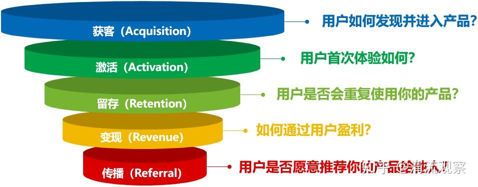
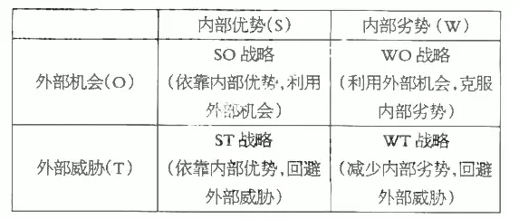
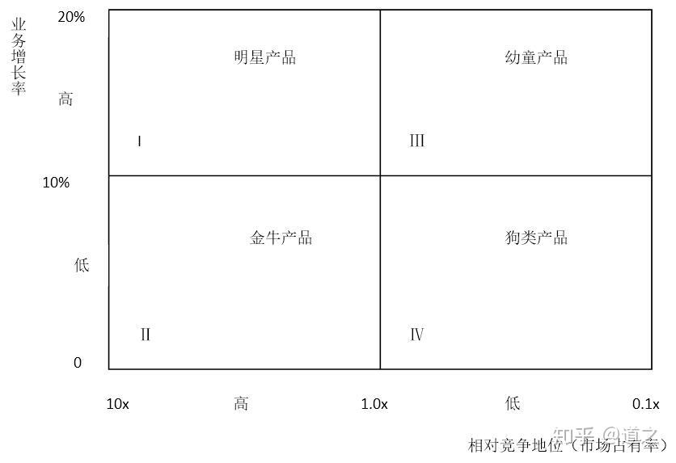

## **AARRR模型**

**一、什么是AARRR模型？**

AARRR模型又称[海盗模型](https://zhida.zhihu.com/search?content_id=256393456&content_type=Article&match_order=1&q=海盗模型&zhida_source=entity)，是分析[用户生命周期](https://zhida.zhihu.com/search?content_id=256393456&content_type=Article&match_order=1&q=用户生命周期&zhida_source=entity)、优化增长策略的核心框架，它由硅谷创业导师Dave McClure于2007年提出，因其五个关键指标的首字母缩写形似海盗的“AARRR”而得名。AARRR模型将用户从初次接触产品到最终实现商业价值的全过程划分为五个阶段，形成一个典型的漏斗结构：

获客（Acquisition）：用户如何发现并进入产品？

激活（Activation）：用户首次体验如何？

留存（Retention）：用户是否会重复使用你的产品？

变现（Revenue）：如何通过用户盈利？

传播（Referral）：用户是否愿意推荐你的产品给他人？





AARRR模型的核心价值‌在于以用户为中心，通过优化每个阶段的运营策略，实现用户生命周期价值（LTV）的最大化，并确保其远高于用户获取成本（CAC）和[运营成本](https://zhida.zhihu.com/search?content_id=256393456&content_type=Article&match_order=1&q=运营成本&zhida_source=entity)（COC）之和。这一模型广泛应用于互联网产品的用户增长和数据分析中，是运营人员必备的增长模型。


**二、AARRR怎么做？**

**获客（Acquisition）**

**1.核心目标：**优化成本，扩大规模

**2.关键指标：**注册量、[获客成本](https://zhida.zhihu.com/search?content_id=256393456&content_type=Article&match_order=1&q=获客成本&zhida_source=entity)（**Customer Acquisition Cost** CAC）、投入产出（ROI）

**3.运营策略**

①渠道分类：获客阶段我们需要尽可能多的去尝试各种渠道，常见的渠道有3种：付费渠道（如SEM、ASA、信息流、KOL、线下广告等）、免费渠道（SEO、ASO、资源置换、软文营销等）、裂变渠道（裂变活动、分享任务等）。

②渠道筛选：我们需要从注册量、获客成本、投入产出这三个维度对所有渠道进行分析，并进行筛选，评估哪些是低投入低产出渠道，哪些是低投入高产出渠道，哪些是高投入低产出渠道，哪些是高投入高产出渠道。

③渠道优化：对低产出的渠道排查问题，是该渠道的用户和产品匹配度低，还是素材或投放策略、流程问题，如果是匹配度低，可以考虑逐渐减少在该渠道的预算投入，如果是素材或投放策略、流程问题，则需调整素材和投放策略，排查流程问题，直到投入产出大于1；同时对高产出的渠道分析是否有可以提升的优化点，比如素材、投放策略或者流程优化等，进一步提升产出效果。

**4.实战案例分析**

以某教育工具app应用市场获客为例

①分析诊断后发现点击到下载转化率只有10%。优化了关键词精准度和主标副标、描述文案&应用截图后，详情页转化率提升至13%左右。app增加好评弹窗引导后，每日新增几十条五星好评，大约2个月时间（期间继续迭代过1次描述文案和应用截图），应用评分从3.3提升至4.7，详情页转化率提升至17%左右。

②注册转化率35%-56%左右。去掉app引导页、权限获取后置及启动app默认弹出本机号码一键登录页后（原先登录后置且只有验证码登录），注册转化率提升至46%-68%，各市场均有接近10个点以上的提升，平均获客成本从15元降至10元左右。


**激活（Activation）**

**1.核心目标：**让潜在用户真正使用你的产品

**2.关键指标：**激活率（关键行为完成率）

**3.运营策略**

①找到体现产品核心价值的关键行为（[啊哈时刻](https://zhida.zhihu.com/search?content_id=256393456&content_type=Article&match_order=1&q=啊哈时刻&zhida_source=entity)），并创建[转化漏斗](https://zhida.zhihu.com/search?content_id=256393456&content_type=Article&match_order=1&q=转化漏斗&zhida_source=entity)。提高激活率的核心在于让用户快速体验产品的核心价值（即增长黑客里的啊哈时刻），比如社交产品的关键行为是完成一次对话、电商产品的关键行为是完成一次下单等。找到关键行为，列出用户从进入app到完成这个关键行为需要经历哪些步骤，并创建转化漏斗，关注用户从进入app到完成关键行为的每一个环节的转化率和流失率。

②优化新用户体验，消除用户使用过程中的阻碍，最大程度提升关键行为完成率。比如简化操作流程、增加新手引导，降低用户使用成本。

③奖励关键行为，提升用户完成关键行为的动力。比如抖音新人限时福利首单0.01元。

**4.实战案例分析**

以某资讯app为例，新用户首次进入app弹出提现0.1元弹窗引导，并将引导入口置于首页醒目位置，通过新手任务的形式引导用户快速完成阅读、获取金币、提现0.1元到银行卡等动作，试验组新用户首日提现率由54%提升至73%，试验组次留率由41%提升至47%。奖励关键行为&互动式、傻瓜式的交互设计，让用户无需思考，通过简单操作即可获得真实收益，意识到“时间变现”的可能性，从而更加便捷的体验到啊哈时刻。


**留存（Retention）**

**1.核心目标：**唤醒并留住用户

**2.关键指标：**留存率

**3.运营策略**

①计算产品N天留存率，留存率 =（指定时间后活跃的用户数 /初始用户数）× 100%。注意：不同类型产品的留存标准或要求有所不同，比如电商平台通常将留存定义为浏览商品/下单等行为，社交产品通常会将留存定义为完成特定社交行为：发送消息/点赞/评论等。

②[用户留存分析](https://zhida.zhihu.com/search?content_id=256393456&content_type=Article&match_order=1&q=用户留存分析&zhida_source=entity)，找到产品留存魔法数字。使用群组分析法，跟踪高度活跃用户的使用路径和关键行为，和低活跃用户进行对比，找到用户高度活跃的原因/关键行为（产品留存的魔法数字），并通过试验验证可行性，比如Facebook发现10天内添加7个好友的留存率更高，Linkedin发现新用户一周内加到5个好友，留存率和使用率将提升3-5倍。

③搭建激励体系，让用户养成使用习惯。常见的激励体系有：荣誉体系（勋章/成就体系）、成长体系、积分体系、社交体系等，通过利益/荣誉/社交/积分等有形或无形的奖励，激励用户使用产品各种功能，感受产品价值，养成使用习惯，从而提升用户留存。

④通过优化和迭代现有的产品功能、引导并激励用户持续使用产品、挖掘用户需求定期推出新功能等，让用户持续使用产品，保持长期活跃。

⑤用户流失分析及流失用户召回，分析用户流失原因，根据流失原因制定用户召回策略。

**4.实战案例分析**

以某资讯app为例，通过积分体系（金币可兑换现金提现）激励用户每日完成阅读、分享等动作，以金币兑换现金的物质激励的方式，培养用户养成使用产品阅读和分享的习惯，7留等指标均在35%以上。


**变现（Revenue）**

**1.核心目标：**提高每位用户带来的收益

**2.关键指标：**GMV、ARPU、LTV

**3.运营策略**

①了解产品的变现模式，常见的变现模式有：商品销售、广告变现、电商导购、会员增值服务等，不同的变现模式会有不同的运营策略。

②创建[变现漏斗](https://zhida.zhihu.com/search?content_id=256393456&content_type=Article&match_order=1&q=变现漏斗&zhida_source=entity)，分析从获客到留存整个过程中，所有可能从用户身上变现的机会，并进一步分析哪些环节带来的收益最高，哪些环节转化率低，对转化率低的环节进行优化，比如某环节的引导文案、落地页文案、支付流程等等。

③优化定价，分析不同定价带来的收益转化，定期进行定价试验，以应对市场、季节性、竞争对手等变化带来的影响，找到能够带来最大购买量、实现利润最大化的价格，不同渠道、设备或场景的用户付费意愿也不尽相同，比如苹果用户可能比常规的安卓用户愿意支付更高的费用，比如提供不同价格选项组合，增加烟雾弹选项，可以提升价格更高选项的支付率。

④优化付费转化率，使用互惠、承诺和一致、社会认同、权威、喜好、稀缺等原则对变现环节的文案、页面设计进行优化，提升付费转化率。

**4.实战案例分析**

以某教育工具app为例，通过增加用户痛点及解决方案展示、立减优惠券及优惠倒计时、烟雾弹选项、已有xxxxxx人购买、名师团队以及7天无理由退费等内容，使用了互惠、社会认同、权威、喜好、稀缺等原则，提升信任度和优惠紧迫感，付费转化率及客单价较修改前提升明显。


**传播（Referral）**

**1.核心目标：**让用户推荐你的产品

**2.关键指标：**分享率、K因子

**3.运营策略**

①口碑传播，通过过硬的产品质量、良好的用户体验得到用户认可，让用户觉得物超所值，激发分享欲（比如海底捞的“免费美甲”“生日惊喜”服务）。通过品牌价值观（如环保、公益等）吸引认同者主动传播，提升品牌形象。设计老带新/推荐有礼等分享激励活动，吸引老用户把产品推荐给身边的朋友或转发到社交媒体。

②[病毒传播](https://zhida.zhihu.com/search?content_id=256393456&content_type=Article&match_order=1&q=病毒传播&zhida_source=entity)，挖掘产品本身的网络效应（使用产品的人数越多产品体验就越好），比如腾讯在线文档、王者荣耀在线对战等。利用社交裂变机制设计裂变活动，比如拼多多砍一刀、好友助力加速抢火车票等。利用社交货币，激起用户炫耀、身份标签、情绪共鸣等需求，比如网易云的“年度听歌报告”等。设计互动性内容，比如支付宝集五福、微信红包、微信小店送礼功能等。

③建立分享激励机制，通过与产品核心价值相契合的奖励，激励用户分享，比如平台抵用券、会员时长、主推商品的试用装、积分等奖励。

④优化分享体验，在用户分享欲望比较强的场景弹出分享按钮，比如美团外卖在支付成功页植入分享返现按钮，王者荣耀对战结束后的战绩炫耀式分享引导。分享后给到即时奖励和引导，并确保受邀者获得满意的体验。

**4.实战案例分析**

以某资讯app为例，通过独特的师徒裂变模式+任务体系，以极低的获客成本，收获了庞大的用户人群。极具诱人的现金激励，邀请1位好友即可获得11元现金奖励。阶梯式返现及好友唤醒要求，第一天提现3元，第二天提现2元，第三天提现6元，好友需每天完成特定的阅读行为，方可提现当天的现金，确保了用户活跃也避免了无效分享。新用户提现任务，新用户1元即可提现，打消用户的使用顾虑，所做即得，即时反馈，从而更有动力进行分享。


**三、总结**

AARRR模型不仅是用户增长的分析工具，更是精细化运营的指南针。通过拆解用户生命周期的五个阶段，可以系统性地优化产品、提升盈利，并形成“获客—激活—留存—变现—传播”的增长闭环，促进业务实现良性增长。而不同的业务场景和产品阶段，所关注的重点也会有所不同，这就需要我们要根据具体的业务场景进行分析，因地制宜，方能使制定的运营策略行之有效，达到业务增长的目的。


## 杜邦分析法：深度解析盈利能力的“手术刀”

另一个极其重要的数据分析框架——**杜邦分析法**。

它与AARRR模型（偏向用户生命周期和增长）不同，杜邦分析法更侧重于**财务和经营效益**的深度拆解，是分析企业**盈利能力**的经典思维模型。

---

**杜邦分析法：深度解析盈利能力的“手术刀”**

**1. 核心概念：是什么？**

**杜邦分析法（DuPont Analysis）** 是利用几种主要的财务比率之间的关系来**综合地分析企业的财务状况**，特别是对**净资产收益率（Return on Equity, ROE）** 进行逐级分解，以评估公司盈利能力和股东权益回报水平的方法。

它的核心思想是：**不满足于看一个单一的最终结果（如ROE），而是像剥洋葱一样，将这个结果层层分解为多项财务指标的乘积，从而系统地分析导致这个结果的原因。**

**2. 核心公式：三层拆解体系**

杜邦分析体系的核心是ROE公式，其最经典的三因素分解如下：

**第一层：ROE = 净利润 / 股东权益**

**第二层：ROE = (净利润 / 销售收入) × (销售收入 / 总资产) × (总资产 / 股东权益)**

**第三层（赋予业务含义）：**
**ROE = 净利润率 × 总资产周转率 × 权益乘数**

现在，我们来逐一拆解这三个核心因子：

1.  **净利润率 (Net Profit Margin)**
    *   **公式：** 净利润 / 销售收入
    *   **业务含义：** 衡量公司的**盈利能力**或**成本控制能力**。表示每卖出一块钱的产品，公司能赚到多少净利润。
    *   **分析视角：** 利润率低，说明产品本身可能不赚钱，或者公司的销售成本、管理费用等过高。这属于 **“卖得贵不贵”** 的问题。

2.  **总资产周转率 (Total Asset Turnover)**
    *   **公式：** 销售收入 / 总资产
    *   **业务含义：** 衡量公司**资产运营效率**的高低。表示每一块钱的资产能产生多少销售收入。
    *   **分析视角：** 周转率低，说明公司资产（如厂房、设备、存货、应收账款）利用效率低下，可能存在大量闲置资产或库存积压。这属于 **“卖得快不快”** 的问题。

3.  **权益乘数 (Equity Multiplier)**
    *   **公式：** 总资产 / 股东权益
    *   **业务含义：** 衡量公司的**财务杠杆水平**。表示公司利用债务融资来放大收益的程度。
    *   **分析视角：** 权益乘数高，说明公司负债程度高，用别人的钱来赚钱。这能放大ROE，但同时也**增加了财务风险**。这属于 **“玩得险不险”** 的问题。

**一句话总结：ROE的高低，取决于公司“卖得贵不贵”（利润率）、“卖得快不快”（周转率）和“玩得险不险”（杠杆率）。**


**3. 数据分析师如何应用杜邦分析法？**

你的工作远不止于计算这三个比率，而是**解读数字背后的业务故事**，并为决策提供支持。

**应用场景：**

*   **业绩归因：** 公司今年ROE提升了，是因为利润提高了，还是资产周转加快了，或是加了杠杆？
*   **横向对比：** 对比公司与竞争对手的ROE。你会发现：
    *   **茅台模式：** 高利润率 × 低周转率 （产品利润极高，但生产销售周期长）
    *   **沃尔玛模式：** 低利润率 × 高周转率 （薄利多销，资产周转极快）
    *   通过对比，可以清晰看出一家公司的**核心商业模式和竞争优势**所在。
*   **问题诊断：** 如果ROE下降，可以迅速定位问题根源：
    *   是**利润率**下降了？（原材料涨价？促销打折太多？）
    *   是**周转率**变慢了？（库存积压？应收账款回收变慢？）
    *   是**杠杆**降低了？（公司主动降负债？）

**数据分析实战案例：**

**问题：** “某零售公司今年ROE同比去年显著下滑，请分析原因。”

**你的分析思路：**

1.  **数据准备：** 收集公司今年和去年的《利润表》和《资产负债表》。
2.  **计算比率：**
    *   计算出两年各自的ROE、净利润率、总资产周转率和权益乘数。
3.  **对比分析：**
    *   发现今年ROE从15%降到了10%。
    *   拆解后发现：
        *   净利润率从5%降到了4%。（盈利能力问题）
        *   总资产周转率从1.5次降到了1.2次。（运营效率问题）
        *   权益乘数保持2.0不变。（杠杆政策未变）
4.  **深度挖掘（进一步拆解）：**
    *   **针对利润率下降：** 再拆解成本结构。发现“销售费用率”大幅上升。进一步业务调研发现，公司今年投放了大量效果不佳的线上广告，导致获客成本飙升。
    *   **针对周转率下降：** 拆解流动资产。发现“存货周转天数”从60天增加到了90天。进一步分析SKU，发现某类新品服饰滞销严重，造成了库存积压。
5.  **得出结论与建议：**
    *   **结论：** 公司ROE下滑的主要原因是**营销效率降低导致利润率下降**和**库存管理不善导致资产周转率下降**。
    *   ** actionable建议：**
        *   （对市场部）评估并优化广告渠道，聚焦ROI更高的渠道，降低获客成本。
        *   （对运营/商品部）制定滞销品的清理计划（如打折促销），并未来建立更精准的销售预测模型，避免过度采购。


**4. 杜邦分析法的进阶与注意事项**

*   **更细的拆解：** 上述三因素模型还可以继续向下拆解。例如，净利润率可以拆解为（毛利率 - 各项费用率），总资产周转率可以拆解为（应收账款周转率、存货周转率、固定资产周转率等）。
*   **注意行业特性：** 不同行业的三因素正常水平差异极大。比较时务必与**行业标杆**或**行业平均值**对比，而非跨行业比较。
*   **警惕高杠杆：** 高的权益乘数（高杠杆）是一把双刃剑。它在经济好时能放大收益，但在经济下行时也会放大亏损，甚至导致资金链断裂。分析时一定要结合公司的偿债能力（如流动比率、利息保障倍数）来看。

---

**总结：杜邦分析法 vs. AARRR模型**

| 特性         | **杜邦分析法**                                    | **AARRR模型**                               |
| :----------- | :------------------------------------------------ | :------------------------------------------ |
| **核心目标** | **分解盈利能力（ROE）**，评估财务效益             | **分解用户生命周期**，实现用户增长          |
| **关注焦点** | **财务指标**（利润、资产、负债）                  | **用户行为指标**（获取、激活、留存、收入）  |
| **主要领域** | 财务分析、战略分析、投资分析                      | 产品运营、市场营销、用户增长                |
| **思维模式** | retrospective（ retrospective），向后看，解释结果 | **Prospective（前瞻性）**，向前看，指导行动 |

作为一名优秀的数据分析师，你需要根据你面对的**业务问题**，灵活调用不同的分析框架。当老板关心“我们为啥不赚钱了？”时，杜邦分析法是你的利器；当产品经理问“怎么才能让更多用户付费？”时，AARRR模型则更加适用。

掌握多种模型，并能准确判断使用场景，是你数据思维成熟的重要标志。


## 帕累托法则

一个在商业和数据分析中无处不在的强大思维模型——**帕累托法则（Pareto Principle）**。

---

**一、核心定义：关键的少数与次要的多数**

**帕累托法则**，俗称**二八定律（80/20 Rule）**，其核心思想是：

> **在任何一组事物中，最重要的、起决定性作用的通常只占其中约20%，其余80%尽管是多数，却是次要的。**

这是一种普遍存在的**不平衡法则**，它告诉我们，因和果、投入和产出、努力和报酬之间，普遍存在着一种无法平衡的关系。

**重要提示：** 80/20 不是一个精确的数学公式，而是一个比喻和基准（可能是 90/10、75/25 等），其精髓是**分布的不平衡性**，而非具体的数字。

---

**二、无处不在的帕累托法则（举例）**

这个法则几乎适用于所有领域：

*   **商业：**
    *   80% 的利润来自 20% 的客户。
    *   80% 的销售额来自 20% 的产品。
    *   80% 的投诉来自 20% 的用户。
*   **项目管理：**
    *   80% 的项目成果由 20% 最关键的任务决定。
    *   80% 的时间花费在 20% 的工作上。
*   **个人效能：**
    *   80% 的成就来自于 20% 最有效率的行动。
    *   80% 的阅读收获来自 20% 最核心的书籍章节。
*   **社会现象：**
    *   世界上 80% 的财富掌握在 20% 的人手中。（维尔弗雷多·帕累托最初就是在研究意大利的土地所有权时发现这一规律的）

---

**三、数据分析师如何应用帕累托法则？**

对于数据分析师而言，帕累托法则不是一个需要被证明的理论，而是一个**指导分析和行动的强大思维工具**。它的主要应用是**识别出“关键的20%”，从而优先分配资源，实现效率最大化**。

**1. 客户分析（Customer Relationship Management CRM）**

*   **应用：** 进行**客户分层**。
*   **方法：**
    1.  将所有客户按照其贡献的利润或销售额从高到低排序。
    2.  计算累计贡献百分比。
    3.  你会发现，排名前20%左右的客户很可能贡献了80%左右的收入。
*   **行动建议：**
    *   **重点维护：** 将这20%的客户标记为“高价值客户（VIP）”，配备专属客户经理，提供定制化服务，优先处理他们的需求。
    *   **差异化策略：** 对中间部分客户采用标准化的自动化服务；对底部贡献极低的客户，甚至可以评估其服务成本是否过高，考虑优化或淘汰。
    *   **目标：** 将有限的资源（人力、资金、时间）投入到投资回报率最高的客户群体上。


**2. 产品与库存管理**

*   **应用：** **ABC分类法**——这是帕累托法则在供应链管理中最直接的应用。
*   **方法：**
    *   **A类物品 (约占SKU *Stock* Keeping Unit 的20%)：** 价值最高，占总库存价值的约80%。需要重点管理，精确预测需求，保持较低的安全库存。
    *   **B类物品 (约占SKU的30%)：** 中等价值和用量。进行常规管理。
    *   **C类物品 (约占SKU的50%)：** 价值最低，只占总价值的约5%。进行简化管理，可以采用大批量订货以减少管理成本。
*   **行动建议：** 优化库存结构，避免在低价值的C类商品上过度浪费管理精力。


**3. 问题诊断与根因分析（Root Cause Analysis）**

*   **应用：** 快速定位核心问题。
*   **方法：**
    *   当面临大量bug、客户投诉或质量缺陷时，将它们按类型或原因进行分类。
    *   绘制**帕累托图（Pareto Chart）**——一种按频率排序的条形图+累计百分比的折线图。
*   **行动建议：**
    *   图表会清晰地显示，往往是**一两个问题类型**导致了大部分（约80%）的缺陷。
    *   团队应集中全力优先解决这“关键的少数”问题，而不是试图同时处理所有问题。这能最快、最有效地提升整体质量。


**4. 市场与运营渠道分析**

*   **应用：** 评估渠道ROI（投资回报率）。
*   **方法：** 分析各个获客渠道（搜索引擎、社交媒体、线下活动等）的投入（成本）和产出（转化用户数、高质量用户数）。
*   **行动建议：**
    *   你很可能会发现，80%的有效流量或高质量用户来自20%的渠道。
    *   果断减少或砍掉效果差的渠道，将预算和精力集中到高效渠道上，并尝试复制其成功模式。

---


**四、如何制作帕累托图？（实战技能）**

帕累托图是数据分析师展示二八现象的利器。制作步骤（以分析客户投诉原因为例）：

1.  **收集数据：** 收集一段时间内的所有投诉记录，并分类（如：物流慢、产品质量差、客服态度不好、包装破损等）。
2.  **计算频数：** 计算每个投诉类别的发生次数。
3.  **排序：** 将类别按频数从高到低排序。
4.  **计算累计百分比：**
    *   第一个类别的百分比 = （该类别频数 / 总频数） * 100%
    *   第二个类别的累计百分比 = 第一个类别的百分比 + （第二个类别频数 / 总频数） * 100%
    *   以此类推。
5.  **绘制图表：**
    *   用**条形图**表示每个类别的频数（左Y轴）。
    *   用**折线图**表示累计百分比（右Y轴）。
6.  **分析：** 观察折线图，通常累计百分比达到80%时所覆盖的前几个类别，就是你需要优先解决的“关键少数”。

---


**五、误区与注意事项**

1.  **不是绝对的数学定律：** 不要僵化地追求80/20这个数字。它可能是70/30或90/10。核心是**承认不平衡的存在并找到那个关键的临界点**。
2.  **不能忽视“80%”：** 二八法则的目的是优化资源分配，**而不是完全忽略那80%**。例如，虽然20%的客户贡献了80%的利润，但那80%的客户贡献了剩余的20%利润并带来了规模效应，同样需要合适的策略来维护，他们也可能是未来的“20%”。
3.  **动态变化：** 今天的“20%”可能不是明天的“20%”。需要定期进行分析，动态调整策略。

**总结**

对数据分析师而言，**帕累托法则是一种关于效率和优先级的哲学**。它教会我们：

*   **不要平均地看待所有数据：** 世界是不平衡的，要用分层、分类的思维去分析。
*   **优先解决主要矛盾：** 通过分析快速找到最能影响结果的关键因子，从而驱动业务做出最有效的决策。
*   **化繁为简：** 在面对复杂问题时，它能提供一个清晰的分析框架和行动指南。

当你面对海量数据不知从何下手时，不妨问问自己：“**这里的二八定律是什么？哪20%的因素导致了80%的结果？**” 这个问题将成为你开启分析大门的金钥匙。


## **SWOT分析法**

一个经典分析框架——**SWOT分析法**。这是一个极具战略高度、用于全面评估局势的思维工具，与之前几个偏向具体指标的分析模型形成完美互补。

---

**一、核心定义：全局视野下的战略诊断工具**

**SWOT分析法**（也称态势分析法）是一种通过评估组织的**内部优势与劣势**、**外部机会与威胁**，从而将公司战略与内部资源、外部环境有机结合起来的一种科学的分析方法。

它的核心价值在于提供了一种**结构化的思考方式**，帮助决策者系统性地审视全局，而不是零散地考虑问题。

*   **S （Strengths） 优势**：组织内部的积极因素，即**你做得好、比竞争对手强的地方**。例如：品牌声誉、专利技术、成本优势、忠诚的客户群、优秀的团队。
*   **W （Weaknesses） 劣势**：组织内部的消极因素，即**你需要改进、不如竞争对手的地方**。例如：管理混乱、资金短缺、产品线单一、高负债率、技术落后。
*   **O （Opportunities） 机会**：外部环境中的积极因素，即**市场、政策、技术等变化带来的有利趋势**。例如：新市场出现、技术进步、消费趋势变化、政策扶持、竞争对手失误。
*   **T （Threats） 威胁**：外部环境中的消极因素，即**可能对组织造成不利影响的变化**。例如：新竞争对手出现、市场需求下降、经济衰退、不利的政策变化、替代品涌现。

---


**二、如何构建一个SWOT矩阵？**

构建SWOT分析通常以一张四象限矩阵图的形式呈现，直观且清晰。




**SWOT分析矩阵**

| **外部因素 External Factors** **内部因素 Internal Factors**  | **优势 (S)** <br> e.g., 品牌力强，用户体验好 <br> e.g., 技术领先，数据积累深厚 | **劣势 (W)** <br> e.g., 变现模式单一 <br> e.g., 运营成本高   |
| :----------------------------------------------------------- | :----------------------------------------------------------- | :----------------------------------------------------------- |
|                                                              |                                                              |                                                              |
| **机会 (O)** <br> e.g., 5G技术普及，带来新场景 <br> e.g., 海外市场政策开放 | **SO策略（增长型战略）** <br> **如何利用优势抓住机会？** <br> *策略：利用技术优势，率先开发5G场景下的新功能，抢占新市场。* | **WO策略（扭转型战略）** <br> **如何利用机会克服劣势？** <br> *策略：借出海机会，与当地巨头合作，弥补自身渠道劣势，同时探索多元化收入模式。* |
| **威胁 (T)** <br> e.g., 用户隐私监管趋严 <br> e.g., 头部竞品开始价格战 | **ST策略（多元化/防御型战略）** <br> **如何利用优势规避威胁？** <br> *策略：利用品牌信任度和良好的用户关系，强调数据安全承诺，差异化竞争，避免卷入价格战。* | **WT策略（防御型战略）** <br> **如何规避劣势和威胁？** <br> *策略：削减非核心项目开支，聚焦核心业务以求生存，或考虑战略合作/合并。* |

---

**三、数据分析师在SWOT分析中的角色**

你可能会问：“SWOT看起来像是CEO和管理层做的定性分析，数据分析师做什么？”

你的价值在于：**用数据为SWOT的每一个象限提供客观、量化的支撑，让主观判断变得有据可依**，避免分析会变成“拍脑袋”的空谈。

**1. 量化优势 (S) 与劣势 (W)**

*   **优势：**
    *   ** claim:** “我们的用户粘性很高。”
    *   **数据支撑：** 提供**DAU/MAU**比率、**用户日均使用时长**、**7日/30日留存率**的曲线，并与主要竞争对手进行对标（Benchmarking）。
    *   ** claim:** “我们的成本控制得更好。”
    *   **数据支撑：** 分析**单位运营成本**、**获客成本（CAC）** 与行业平均水平的对比数据。
*   **劣势：**
    *   ** claim:** “我们的用户付费意愿不强。”
    *   **数据支撑：** 展示**付费转化率**、**平均每用户收入（ARPU）** 的漏斗图，并与行业标杆对比，指出具体流失环节。
    *   ** claim:** “某功能用户满意度低。”
    *   **数据支撑：** 提取App Store/客服渠道的**差评主题分类**和**NPS（净推荐值）** 数据，进行情感分析，定位问题点。

**2. 识别机会 (O) 与威胁 (T)**

*   **机会：**
    *   ** claim:** “下沉市场存在巨大机会。”
    *   **数据支撑：** 提供行业报告中的数据，如下沉市场**用户规模增速**、**智能手机普及率**、**人均可支配收入变化趋势**图表。
    *   ** claim:** “AI技术能提升我们的效率。”
    *   **数据支撑：** 通过A/B测试证明引入AI客服后，**问题解决率**的提升和**平均响应时间**的下降。
*   **威胁：**
    *   ** claim:** “竞争对手X对我们造成了巨大威胁。”
    *   **数据支撑：** 通过爬虫或第三方数据（如QuestMobile）监控竞品的**用户增长趋势**、**市场份额变化**、**主要活动声量**。
    *   ** claim:** “新的数据法规增加了合规风险。”
    *   **数据支撑：** 评估新法规下，需要调整的业务线所涉及的**用户数据量**及其对应的**收入占比**，量化该威胁的潜在财务影响。

**四、实战应用：以某共享单车公司为例**

*   **S (优势):**
    *   数据：App日活行业第一，用户平均每周使用次数达5次。（**数据支撑：** DAU、使用频率）
    *   数据：在一线城市车辆密度最高，平均寻车时间<3分钟。（**数据支撑：** 运营数据、用户调研）
*   **W (劣势):**
    *   数据：车辆损坏率高，达20%，运维成本占总成本35%。（**数据支撑：** 运维报表、成本结构分析）
    *   数据：单次骑行收入同比下降，补贴率仍居高不下。（**数据支撑：** 财务数据、订单分析）
*   **O (机会):**
    *   数据：二三线城市通勤距离（5-10公里）占比提升，适合骑行。（**数据支撑：** 城市交通报告、用户骑行距离分布图）
    *   数据：政府计划新增1000公里自行车专用道。（**数据支撑：** 政策文件、GIS地图分析）
*   **T (威胁):**
    *   数据：竞争对手Z在最近一轮融资中获巨资，市场费用环比增加200%。（**数据支撑：** 新闻监控、第三方市场数据）
    *   数据：地铁站接驳短途需求正被电动滑板车分流，相关订单量下滑10%。（**数据支撑：** 订单起终点分析、竞品分析）

**基于以上数据，可以生成策略：**
*   **SO策略：** 利用高用户活跃度和车辆密度，迅速拓展已规划自行车道的二三线城市。
*   **ST策略：** 利用品牌和用户优势，推出会员套餐等差异化服务，避免与对手Z进行纯价格战。
*   **WO策略：** 在拓展新城市时，投入研发更耐用的车型，并与本地专业化运维团队合作，降低运维成本。
*   **WT策略：** 暂停在已被电动滑板车严重分流区域的车辆投放，优化资源分配。

**五、常见误区与注意事项**

1.  **主观臆断，缺乏数据支撑：** 这是最大的误区。避免说“我们认为品牌很好”，而要说“根据BrandZ报告，我们的品牌价值排名第X，客户满意度调查中NPS为Y”。
2.  **因素混淆：** 严格区分内外部因素。**优势劣势是内部**的，好比你自己的身体素质；**机会威胁是外部**的，好比你遇到的天气和路况。
3.  **泛泛而谈，不够具体：** 列出“品牌优势”不如列出“在35-45岁女性群体中品牌认知度达80%”有用。
4.  **缺乏战略组合：** 不要只列出四个象限就结束了。**核心产出是SO、WO、ST、WT这四类策略**，它们才是指导行动的蓝图。

**总结**

对于数据分析师而言，**SWOT分析法**的价值在于：

*   **提供框架：** 将零散的数据点（用户数据、市场数据、运营数据、竞争数据）系统地归纳入一个清晰的战略框架中。
*   **连接数据与战略：** 你是桥梁，将冰冷的数据转化为有温度、有深度的商业洞察，直接服务于最高层次的战略决策。
*   **促进跨部门沟通：** 一个用数据填充的SWOT矩阵，是统一市场、产品、运营、管理层思想的绝佳工具。

掌握SWOT，意味着你不仅能看到树木（具体指标），更能看清整片森林（全局战略），这是你从一名数据提取员迈向战略型数据分析师的关键一步。


## 波士顿矩阵

**波士顿矩阵（BCG Matrix）**，这是一个非常经典的战略分析工具，对于数据运营和商业分析岗位来说至关重要。它能帮助你理解产品组合，并做出资源分配决策。

**一、波士顿矩阵是什么？**

**波士顿矩阵（BCG Matrix）**，又称**市场增长率-相对市场份额矩阵**、**四象限分析法**，由波士顿咨询公司（BCG）在1970年代提出。

它的核心思想是：**通过两个关键维度——市场吸引力和企业竞争力——将企业的所有产品或业务单元进行分类，从而为每个单元制定相应的战略，并决定资源的投入方向。**

简单说，它帮你回答：“我们应该把钱投给谁？应该从谁身上赚钱？应该淘汰谁？”

---

**二、核心模型：两个维度和四个象限**

波士顿矩阵的分析框架基于两个维度和由此划分的四个象限：

**两个维度：**

1.  **市场增长率（Market Growth Rate）**
    *   **定义**：产品或业务所在市场每年的增长率（通常以百分比计算，如销售额增长率）。
    *   **含义**：代表**市场的吸引力**。高增长市场意味着潜力大，机会多，但也通常需要大量资金投入来维持增长。

2.  **相对市场份额（Relative Market Share）**
    *   **定义**：本企业该产品的市场份额与**最大竞争对手**的市场份额的比值。
    *   **计算公式**：`本公司产品市场份额 / 最大竞争对手的市场份额`
    *   **含义**：代表**企业在该市场上的竞争力**。比值大于1，表示你是市场领导者；比值小于1，表示你是市场追随者。

**四个象限：**

以市场增长率为纵轴（高在上，低在下），相对市场份额为横轴（高在左，低在右），形成四个象限，每个象限对应一类产品：




| 象限               | 名称（比喻）                          | 特征                                                 | 战略含义                                                     | 现金流                                       |
| :----------------- | :------------------------------------ | :--------------------------------------------------- | :----------------------------------------------------------- | :------------------------------------------- |
| **高增长、高份额** | **明星（Stars）**                     | 处于高速增长的市场中，并且是市场的领导者。           | **加大投资，巩固优势**。目标是将其转化为未来的“现金牛”。需要大量资金投入以保持领先地位。 | **基本平衡**（大量投入，大量产出）           |
| **低增长、高份额** | **现金牛（Cash Cows）**               | 处于成熟、低速增长的市场中，但拥有统治性的市场份额。 | **收割（Milk）**。无需大量再投资，应利用其产生的丰厚利润和现金流，来支持其他业务（如明星和问号）。 | **正现金流**（投入少，产出多）               |
| **高增长、低份额** | **问号（Question Marks）** / 问题儿童 | 处于高增长市场，但市场份额很低。                     | **分析决策**。要么选择**加大投资**，使其转变为“明星”；要么选择**放弃/剥离**，将资源用于其他地方。具有不确定性。 | **负现金流**（需要大量投入，但产出目前很少） |
| **低增长、低份额** | **瘦狗（Dogs）**                      | 在停滞的市场中只有很小的市场份额。                   | **撤退（Divest）**。通常意味着亏损或微利。战略上应考虑**出售、清算**或逐步退出，释放被占用的资源。 | **中性或负现金流**                           |

---

**三、一个生动的例子：视频网站的产品/内容分析**

假设你是一家视频网站（如Netflix、Bilibili、爱奇艺）的数据运营官，你可以用波士顿矩阵来分析你的**内容库**或**业务板块**。

1.  **明星（Stars）**
    *   **是什么**：一部刚刚上线的**爆款独家自制剧**。它引发了现象级讨论（**市场增长率高**），并且其播放量远超同期其他剧集（**相对市场份额高**）。
    *   **策略**：立即投入更多推广资源（首页Banner、推送通知）、制作周边、筹备第二季。目标是把它打造成长期的流量和口碑担当。

2.  **现金牛（Cash Cows）**
    *   **是什么**：一部已经播出多年的**经典老剧**（比如《还珠格格》、《老友记》）。它的市场已经不增长了，但每年依然有稳定且巨大的点播量，是站内的“镇站之宝”（**相对市场份额极高**）。
    *   **策略**：几乎不需要额外的推广成本，但它能持续带来会员订阅和广告收入。它赚来的钱，可以用来投资新的“爆款自制剧”（问号）。

3.  **问号（Question Marks）**
    *   **是什么**：一个**新引入的小众垂直品类**，比如“4K超高清纪录片专区”。市场（追求高品质的观众）在快速增长，但目前看的人还很少，份额很低。
    *   **策略**：需要做出抉择。是加大投入（购买更多优质纪录片、大力宣传）把它培养成未来的“明星”？还是判断其潜力有限，及时止损，不再续订版权？

4.  **瘦狗（Dogs）**
    *   **是什么**：网站早期购买的**一批低质量、无版权的短视频内容**。市场早已不关注这类内容，它们也几乎没人点播。
    *   **策略**：下架这些内容，节省服务器存储成本和版权维护精力。将资源腾出来给更有价值的内容。

---

**四、数据分析师/运营如何应用它？**

1.  **定义指标与收集数据**：
    *   **市场增长率**：需要行业报告、第三方数据平台（如QuestMobile、艾瑞咨询）或内部估算来确定整个大盘的增速。
    *   **相对市场份额**：需要内部销售/用户数据（你的份额）和竞争对手的公开数据或估算数据（对手的份额）。

2.  **绘制矩阵**：
    *   以市场增长率为Y轴，相对市场份额为X轴（通常用对数尺度）。
    *   以每个产品的销售额或利润额为气泡大小，画在矩阵上。
    *   设定分界线（中位数或行业标准），将图表划分为四个象限。

3.  **分析与洞察**：
    *   **整体布局分析**：公司的产品组合是否健康？是否有足够的“现金牛”来供养“明星”和“问号”？“瘦狗”是否过多？
    *   **动态趋势分析**：观察产品每年的移动轨迹。一个成功的“问号”应该向右上方移动（成为明星），一个成功的“明星”最终会随着市场成熟落入“现金牛”区域。如果一个“现金牛”开始向左下方滑落（份额丢失），那就是危险的信号。

4.  **制定数据驱动的策略**：
    *   根据每个象限的战略含义，提出具体的、可量化的行动建议。
    *   **例如**：“建议将A产品（问号）的营销预算增加50%，目标是在下季度将其市场份额提升0.5%，使其进入明星象限。”

---

**五、优点与局限性**

*   **优点**：
    *   **直观清晰**：将复杂的业务状况简化为一张易懂的图表。
    *   **强调现金流**：迫使企业思考不同业务间的资金输送关系。
    *   **战略启发**：为资源分配提供了明确的决策框架。

*   **局限性（非常重要，面试时能提到会加分）**：
    *   **维度过于简化**：仅用两个维度评价业务可能不全面（忽略了品牌、技术、团队等其他重要因素）。
    *   **市场定义模糊**：如何准确界定“市场”边界？一个产品可能属于多个细分市场。
    *   **忽视协同效应**：有时“瘦狗”业务可能对其他重要业务有战略支持作用，不能简单放弃。
    *   **忽视中间状态**：“现金牛”和“瘦狗”之间的业务可能被忽视。

**总结来说，波士顿矩阵是一个强大的“思维模型”和“沟通工具”**。它不能替代深入的数据分析，但能为分析提供方向，并帮助数据从业者用业务和战略的语言与管理者沟通，从而体现数据的巨大价值。在面试中，展示你理解并能应用这个模型，会极大地提升面试官对你的商业sense的评价。


## RFM模型

FM 模型是 **数据运营 / 用户运营 / 精细化营销** 中非常经典的用户价值分层方法。下面我给你系统、详细地介绍一下：

------

**一、RFM 模型是什么**

RFM 由三个维度构成，用于衡量用户价值和活跃度：

- **R (Recency，最近一次消费时间)**
  - 指用户最后一次消费或活跃的时间距离现在多久。
  - 越近，说明用户活跃度越高，留存价值越大。
- **F (Frequency，消费频率)**
  - 一定周期内的消费或活跃次数。
  - 越频繁，说明用户粘性越高。
- **M (Monetary，消费金额)**
  - 一定周期内的累计消费金额（或贡献价值）。
  - 金额越高，说明该用户的价值越大。

 总结：RFM 本质上是通过 **最近一次行为 + 行为频率 + 贡献价值** 来对用户分层。

------

**二、RFM 模型的常见用法**

1. **用户分层**
   - 通过对 R、F、M 各打分（如 1/0，高低两档，或者 1-5 分），组合出不同的用户类别。
   - 比如：
     - R=高，F=高，M=高 → **高价值核心用户**
     - R=低，F=低，M=低 → **流失/低价值用户**
     - R=高，F=低，M=高 → **潜力用户（有能力但不常来）**
2. **精细化运营策略**
   - 针对不同分层，采取差异化运营手段：
     - 高价值用户：VIP 会员、专属客服、定向优惠。
     - 新用户：新手礼包、快速激活。
     - 沉睡用户：召回活动、优惠券刺激。
     - 潜力用户：加强推送、重点培养。
3. **业务应用场景**
   - 电商：用户分群，制定精准营销策略。
   - 游戏：付费用户分层，设计留存与付费激励。
   - 金融：客户价值分级，制定不同的理财推荐策略。
   - SaaS/互联网：用户活跃度分层，优化产品留存。

------

**三、RFM 打分与分群方法**

1. **简单二分法（常用入门方法）**

   - R、F、M 三个指标分别划分为 “高（1）/低（0）”。
   - 得到 2 × 2 × 2 = 8 种用户类型。

   | R    | F    | M                  | 用户类型   | 特点                         |
   | ---- | ---- | ------------------ | ---------- | ---------------------------- |
   | 1    | 1    | 1                  | 高价值用户 | 最近活跃、常来、多消费       |
   | 1    | 1    | 0                  | 潜力忠诚   | 最近活跃、常来、金额一般     |
   | 1    | 0    | 1                  | 潜力消费   | 最近活跃、偶尔来、消费金额高 |
   | 0    | 1    | 1                  | 重要保持   | 最近不活跃、但常来、金额高   |
   | 其余 | …    | 低价值或待唤醒用户 |            |                              |

2. **五分位法（更精细）**

   - 将 R、F、M 各分为 1–5 档（如按百分位数切分）。
   - 得到 125 种组合，可再合并为 8–10 大类。
   - 例如：R=5, F=5, M=5 → 核心 VIP 用户。

3. **聚类法（进阶，常见于数据科学岗位）**

   - 对 R、F、M 进行标准化后，用 KMeans/层次聚类做分群。
   - 更灵活，能适应不同业务。

------

**四、RFM 模型的实施步骤**

1. **数据准备**
   - 用户 ID
   - 最近一次消费日期（计算 R）
   - 一定周期内的消费次数（F）
   - 一定周期内的消费金额（M）
2. **计算 R/F/M**
   - R = 分析日期 − 最近一次消费日期
   - F = 消费次数统计
   - M = 消费金额求和
3. **打分/分层**
   - 二分 / 五分位 / 聚类
4. **制定运营策略**
   - 针对不同分群，设计不同运营手段（拉新、留存、促活、召回）。

------

**五、实际案例（电商）**

- 数据：过去 1 年的用户交易数据
- 分析结果：
  - 核心用户（R 近、F 多、M 高）：3% → 贡献 30% 收入
  - 潜力用户（R 近、F 少、M 高）：5% → 可重点促活
  - 沉睡用户（R 久、F 少、M 低）：50% → 可做召回活动

👉 通过差异化运营，能显著提升 ROI（投入产出比）。

------

**六、延伸**

- **RFM+LTV**：结合用户生命周期价值，预测未来贡献。
- **RFM+标签体系**：将用户打上“高价值、潜力、沉睡”等标签，结合推荐/营销系统使用。
- **RFM+机器学习**：作为特征输入，预测用户流失或复购。


## D. MECE

**1. 什么是MECE？**
MECE原则（Mutually Exclusive, Collectively Exhaustive）是麦肯锡咨询方法论的基石之一，中文意思是“**相互独立，完全穷尽**”。

- **相互独立**：意味着问题的各个部分、分类之间没有重叠，是清晰的、分开的。这样分析时不会重复计算，思路清晰。
- **完全穷尽**：意味着所有部分、分类加起来是完整的，没有遗漏任何重要的方面。这确保了分析的全面性。

**2. 为什么数据目标拆解要遵循MECE？**
数据分析的核心是从一个模糊的、宏大的业务目标（如“提升公司利润”）开始，然后将其层层拆解成一个个可量化、可分析、可行动的小指标。

- **例如**：目标“提升公司利润”可以MECE地拆解为：
  - **增加收入**
    - 提高客户数 × 提高客单价
    - 新客户收入 + 老客户复购收入
  - **降低成本**
    - 降低变动成本（如原材料）
    - 降低固定成本（如租金、广告费）
      这个拆解过程就符合MECE：**增加收入**和**降低成本**是“相互独立”的（一个开源，一个节流），并且它们“完全穷尽”了提升利润的所有途径（利润 = 收入 - 成本）。

**3. MECE在数据分析中的应用：**
它指导你在搭建分析框架、设计指标体系、进行维度下钻（Drill-down）时，能够逻辑清晰、全面系统地思考问题，避免重复和遗漏，从而精准地定位到问题的根源。


**案例：数据运营活动复盘**

**活动复盘：** 评估“618”大促活动的效果。

一个简单的复盘可能只说：“本次活动GMV超目标20%，成功！”。但这无法为下次活动提供有效指导。

运用 **MECE原则**进行复盘：

1. **活动目标达成情况 (MECE地看核心指标)**
   - **拉新**：新用户获取数量 vs 目标？新用户成本 vs 预期？
   - **促活/留存**：活动期间DAU/MAU 提升情况？老用户复购率如何？
   - **GMV**：总GMV vs 目标？各品类GMV贡献占比？
   - **品牌**：社交媒体声量、正面评价占比如何？
2. **投入产出分析 (ROI)**
   - **投入**：营销费用（渠道广告、KOL费用、优惠券成本）、人力成本、产品开发资源 (成本类型MECE)
   - **产出**：如上方的GMV、新用户等
   - 计算各渠道的ROI，判断哪些渠道高效，哪些低效。
3. **流程环节分析 (Funnel Conversion)**
   - 分析用户从 **看到活动广告 -> 进入活动页 -> 点击商品 -> 加购 -> 下单 -> 支付** 的全链路转化率。
   - 这个漏斗本身是MECE的，每个环节只属于一个步骤。通过分析可以定位到转化流失最大的环节（例如，很多人进入活动页但不再点击，可能是活动页面设计有问题）。


- **常用MECE维度**：在数据分析中，常用的MECE拆分维度包括：**用户维度**（新/老、渠道来源、 demographics）、**时间维度**（年/月/周/日、活动前/中/后）、**产品维度**（品类、价格带）、**渠道维度**（App/PC/小程序、免费/付费）、**地理维度**（国家、省份）等。
- **MECE是一种思维习惯**：它不一定是完美的，但能强制你进行有逻辑的、结构化的思考。先追求“MECE”，再在过程中不断完善。
- **面试中的应用**：当面试官给你一个案例题时（例如，“如何分析滴滴司机流失问题？”），你可以首先回答：“我会先尝试运用MECE原则，从司机端、平台规则、竞争对手等几个相互独立的方面进行拆解...” 这能立刻展现出你清晰的分析思维，是极大的加分项。


## CPM

详细解析一下CPM（关键路径法）。这是一个在项目管理中极为重要的概念，虽然它不像MECE或AARRR那样直接是数据分析的思维框架，但作为数据从业者，理解它对于管理数据项目、与项目团队协作非常有帮助。

**一、CPM是什么？**

**CPM（Critical Path Method）**，即关键路径法，是一种用于**项目进度规划**的算法模型。它的核心目的是：
1.  **估算整个项目的总耗时。**
2.  **找出项目中哪些任务序列是决定项目工期的“关键”所在。**
3.  **识别哪些任务有“浮动时间”（或称为“时差”），即可以延迟而不影响总工期的余地。**

简单来说，关键路径就是整个项目中最长的一系列连续任务，它直接决定了项目能完成的最短时间。**关键路径上的任何任务一旦延迟，整个项目的最终完成日期就会随之延迟。**

---

**二、核心概念与关键词**

要理解CPM，需要先掌握几个基本概念：

1.  **任务/活动（Activity）**：项目中的具体工作单元。
2.  **依赖关系（Dependency）**：任务之间的逻辑关系。例如：
    *   **完成-开始（Finish-to-Start, FS）**：任务A必须完成后，任务B才能开始。（最常见）
    *   开始-开始（Start-to-Start, SS）
    *   完成-完成（Finish-to-Finish）
3.  **节点（Node）**：通常代表一个任务的开始或结束点。
4.  **路径（Path）**：从项目开始到结束，由一系列任务连接而成的路线。
5.  **关键路径（Critical Path）**：所有路径中，总持续时间最长的路径。
6.  **浮动时间/时差（Float / Slack）**：
    *   **总浮动时间（Total Float）**：一个任务在不影响项目总工期的前提下，可以延迟的时间。
    *   **关键路径上的任务浮动时间为零**。这就是为什么它们“关键”，没有任何延迟的余地。

---

**三、CPM的步骤（通过一个简单例子说明）**

假设你要策划一场数据发布会，我们简化出几个核心任务：

| 任务 | 描述           | 前置任务 | 持续时间(天) |
| :--- | :------------- | :------- | :----------- |
| A    | 准备演讲内容   | 无       | 5            |
| B    | 设计幻灯片     | A        | 3            |
| C    | 预订场地       | 无       | 2            |
| D    | 发送邀请函     | C        | 1            |
| E    | 进行发布会演练 | B, D     | 1            |

**步骤1：列出所有任务及其依赖关系**
如上表所示。任务A和C可以同时开始，因为它们没有前置任务。

**步骤2：绘制网络图（Network Diagram）**
用节点表示事件，用箭头表示任务及其耗时。虽然现在多用软件生成，但理解其原理很重要。
```
[开始]
  | (A:5)
  v
[任务A结束] ---(B:3)---> [任务B结束]
  |                           |
  |                           |
 (C:2)                       (E:1)
  |                           |
  v                           v
[任务C结束] ---(D:1)---> [任务D结束] 
                              |
                              |
                              v
                           [项目结束]
```
**步骤3：找出所有路径，并计算其总时长**
*   **路径 1**: A -> B -> E | 时长 = 5 + 3 + 1 = **9天**
*   **路径 2**: C -> D -> E | 时长 = 2 + 1 + 1 = **4天**

**步骤4：确定关键路径**
比较所有路径的时长，**最长的路径就是关键路径**。因此，**路径1 (A-B-E)** 是关键路径，总项目工期为**9天**。

**步骤5：计算浮动时间**
*   **关键路径 (A-B-E)** 上的所有任务（A, B, E）的**浮动时间均为0**。延迟任何一项都会直接延迟项目。
*   **非关键路径 (C-D-E)** 上的任务有浮动时间。
    *   任务C和D最早可以什么时候开始？最晚必须什么时候开始？
    *   整个路径C-D-E只有4天，但项目总工期是9天。这意味着它们有 **9 - 4 = 5天** 的“浮动时间”。
    *   也就是说，任务C可以延迟最多5天开始，或者任务D可以延迟最多5天开始，只要它们最终不影响任务E按时开始（任务E在关键路径上，必须在第9天结束时完成），整个项目就不会延迟。

---

**四、CPM在数据分析/运营中的应用场景**

虽然CPM本身不是一个数据分析模型，但数据专业人士在以下场景中会接触到它：

1.  **管理数据项目**：当你负责一个复杂的数据分析项目、一个机器学习模型的开发上线或一个数据看板的搭建时，你可以使用CPM来规划项目。
    *   *任务示例*：数据收集、数据清洗、特征工程、模型训练、模型评估、系统集成、部署上线。
    *   你可以清晰地看到，**是“数据清洗”还是“模型训练”处于关键路径上**，从而决定将更多资源（人力、算力）投入哪里以加速项目。

2.  **与项目团队协作**：数据工作常常是更大业务项目的一部分（例如，配合产品经理做一个A/B测试的埋点和分析）。理解项目经理使用的CPM工具（如甘特图），能让你更好地沟通你的工作交付时间，明确你的任务是否在关键路径上，从而管理对方的期望。

3.  **优化流程**：在数据运营中，分析一个常规数据报告的生产流程（每日/每周），找出其中的瓶颈（关键路径），并提出优化建议。例如，如果某个数据库查询任务总是最慢且处于关键路径，那么优化它就能缩短整个报告产出时间。

---

**五、总结：为什么面试官要知道你懂CPM？**

在数据分析/运营的面试中出现CPM，并不是期望你成为项目管理专家，而是为了考察：

1.  **知识广度**：你是否具备基本的商业和项目管理的常识。
2.  **结构化思维**：CPM本身就是一种将复杂项目进行结构化解构的方法，这与数据分析师需要的MECE思维有异曲同工之妙。
3.  **协作能力**：表明你理解项目的整体性，知道自己的数据工作是如何嵌入到更大的业务目标中，并会影响整体进度的。

**最后，回到原题**，CPM是**项目进度管理**的工具，而题目问的是**数据目标拆解**的原则，这是两个完全不同范畴的概念。因此，正确答案毫无疑问是**MECE**。


## 4P理论

4P理论是市场营销中最基础、最经典的框架，对于数据分析师和运营来说，理解它是将数据与业务策略连接起来的桥梁。

**一、4P理论是什么？**

**4P理论**，又称**市场营销组合（Marketing Mix）**，由杰罗姆·麦卡锡（E. Jerome McCarthy）在1960年提出。它为企业提供了一个用于规划和执行营销战略的基本框架，意指企业为了满足目标市场的需求，所能控制的四大类基本营销因素的组合。

可以把它想象成厨师的**四种核心食材**。想要做出一道成功的菜肴（成功的市场营销），你需要巧妙地搭配和运用这四种食材。

---

**二、4P的详细解析**

这四大要素分别是：**Product（产品）**、**Price（价格）**、**Place（渠道）** 和 **Promotion（推广）**。

| P             | 中文     | 核心问题                     | 关键决策点（数据分析师/运营的关注点）                     |
| :------------ | :------- | :--------------------------- | :-------------------------------------------------------- |
| **Product**   | **产品** | 我们向市场提供什么？         | 产品功能、质量、设计、品牌、服务、包装、售后等。          |
| **Price**     | **价格** | 我们如何为产品定价？         | 定价策略（撇脂/渗透定价）、折扣、付款期限、信贷条件等。   |
| **Place**     | **渠道** | 客户在哪里能买到它？         | 分销渠道（线上/线下）、库存管理、物流、覆盖范围、便利性。 |
| **Promotion** | **推广** | 我们如何让客户知道并购买它？ | 广告、公关、促销、人员推销、社交媒体营销、内容营销等。    |

---

**三、4P理论的应用与数据分析的结合**

对于数据从业者而言，4P理论的价值在于它提供了一个**结构化的思维框架**来拆解业务问题，并指导数据分析的方向。每一个“P”都可以被量化、分析和优化。

**1. Product（产品）**

*   **数据分析的应用**：
    *   **用户行为分析**：通过埋点数据分析哪些产品功能使用频率最高？（AARRR模型中的Activation）
    *   **客户反馈分析**：用NLP技术分析评论、客服工单，找出产品改进点。
    *   **A/B测试**：测试不同产品界面、功能设计对用户留存和转化的影响。
    *   **品类管理**：用**波士顿矩阵**分析哪些产品是“现金牛”，哪些是“明星”，指导产品资源分配。

**2. Price（价格）**

*   **数据分析的应用**：
    *   **价格弹性分析**：分析价格变动对销量的影响，找到利润最大化的最优价格点。
    *   **优惠券/折扣策略分析**：评估不同折扣力度对销量、客单价和总体利润的影响。
    *   **竞品价格监控**：爬取竞争对手价格，为自身的定价策略提供数据支持。
    *   **用户分层定价**：分析不同用户群体（新客/老客、不同地区）对价格的敏感度，实施差异化定价。

**3. Place（渠道）**

*   **数据分析的应用**：
    *   **渠道转化分析**：分析不同流量来源（渠道）的用户质量、转化率和ROI（投资回报率）。这是**AARRR模型**中Acquisition环节的核心。
    *   **销售预测与库存优化**：通过历史销售数据预测未来需求，优化库存水平，避免断货或积压。
    *   **线上线下协同分析**：分析“线上下单，线下提货”等全渠道策略的效果。
    *   **地理位置分析**：分析不同地区、门店的销售表现，指导线下资源投放。

**4. Promotion（推广）**

*   **数据分析的应用**：
    *   **营销活动复盘**：这是数据运营最常做的工作。评估每次营销活动的GMV、拉新数、ROI等核心指标。
    *   **用户 Segmentation & Targeting**：将用户分群（如按兴趣、购买力），分析不同人群对推广活动的响应率，实现精准营销。
    *   **广告效果分析**：分析不同广告创意、投放渠道、受众群体的点击率（CTR）、转化率（CVR）和成本（CPA）。
    *   **社交媒体声量分析**：监测活动期间品牌在社交媒体上的提及量和情感倾向。

---

**四、4P理论的演变与局限性**

*   **演变**：随着市场环境变化，4P理论扩展出了**7P**（增加了People-人员, Process-流程, Physical Evidence-物理证据，主要用于服务行业）和**4C**（Customer-顾客, Cost-成本, Convenience-便利, Communication-沟通，更以客户为中心）。
*   **局限性**：
    *   **内部视角**：4P主要从企业可控因素出发，某种程度上忽略了客户的核心地位。因此，现代营销强调要先将**客户需求（Customer Need）** 置于中心，再用4P去满足它。
    *   **静态性**：传统的4P模型显得有些静态，而市场是动态变化的。

**总结与面试视角**

对于面试数据分析/运营岗位的你来说，掌握4P理论意味着：

1.  **拥有商业思维**：你不再只是一个只会跑数据的技术员，而是一个能用业务语言沟通、理解市场策略的分析师。
2.  **构建分析框架**：当被问到“如何提升产品销量？”这类开放性问题时，你可以用4P理论作为**MECE**的框架进行拆解：
    *   “我们可以从4P的角度来分析。**Product**方面，可以分析用户功能使用数据...；**Price**方面，可以分析价格弹性...；**Place**方面，可以评估渠道效率...；**Promotion**方面，可以复盘历史活动效果...”
3.  **连接数据与决策**：你能够清晰地阐述数据如何赋能每一个营销环节的优化，从而驱动业务增长。

这不仅能展现你的数据分析能力，更能体现你深刻的商业洞察力，是面试中的巨大加分项。


## **矩阵式管理（Matrix Management）**

这是一种在现代企业中，尤其是在科技、咨询、项目驱动型公司中非常常见的组织架构形式。理解它对你未来的职业生涯，尤其是在数据这类需要高度协作的岗位中，非常有帮助。

**一、核心定义：打破部门墙的双线汇报**

**矩阵式管理**是一种组织结构，在这种结构下，员工可能同时向**两位或多位经理汇报**，而不是传统的单一垂直汇报线。

通常，这两条汇报线是：
1.  **职能经理（Functional Manager）**：你所在部门的领导（例如，你的数据分析部总监）。他负责你的**专业技能发展、资源分配、长期职业规划和绩效评估**。
2.  **项目经理（Project Manager）**：你当前所参与项目的负责人。他负责你在**该项目中的日常工作、任务分配和项目目标的达成**。

**核心思想**：它旨在打破传统“部门墙”的壁垒，通过创建跨职能的团队，更灵活、更高效地整合和配置资源，以完成特定的项目或任务。

---

**二、一个生动的例子：数据分析师的一天**

假设你是一家大型电商公司的数据分析师。

*   **你的职能归属**：你属于 **“数据部”** 。你的职能经理是数据部的总监。他确保你具备最新的数据分析技能（比如给你报名学习SQL进阶课程），负责你的薪资和晋升。
*   **你的项目任务**：公司要启动一个“618大促”活动，需要组建一个虚拟项目团队。你被抽调进入这个项目组。
    *   这个团队里有来自**市场部**的同事（负责设计活动）、**产品部**的同事（负责页面功能）、**运营部**的同事（负责规则制定），以及你——**数据部**的同事（负责数据监控和效果分析）。
    *   你们的共同领导是这个“618项目”的**项目经理**。

**你的双重角色**：
*   在**技术问题上**，你遇到难题可能会求助数据部的同事或你的职能经理。
*   在**项目进度和工作任务上**，你直接向项目经理汇报，参加项目例会，确保数据分析工作能支撑项目按时上线。

**这就是一个典型的矩阵式管理结构**。你同时为两个上级工作：职能经理和项目经理。

---

**三、为什么需要矩阵式管理？优点与缺点**

**优点（Why Companies Use It）**

1.  **高效利用资源**：专家（如数据分析师、设计师）可以被多个项目共享，避免了每个项目都养一个专职团队的成本和浪费。你做完“618”项目，下一个可能去做“用户增长”项目。
2.  **增强跨部门协作**：打破了部门之间的隔阂，促进了不同专业领域人员的沟通和知识共享。作为数据师，你能更早地了解业务需求（来自市场、运营的同事），从而提供更贴近业务的分析。
3.  **灵活性高**：可以快速组建、调整或解散项目团队来应对市场变化和新的战略优先级，比传统的层级结构更敏捷。
4.  **员工视角**：提供了更广阔的视野和更多样的学习机会。你能接触到公司不同的业务线，理解业务如何运作，这对个人成长非常有益。

**缺点与挑战（The Challenges）**

1.  **双重领导，指令冲突**：这是最大的挑战。如果职能经理和项目经理的优先级不一致（比如职能经理希望你做技术优化，项目经理催你赶项目进度），你会陷入两难境地，无所适从。
2.  **权责不清**：项目经理和职能经理在预算、人员评价、决策权上的界限可能模糊，容易导致扯皮和决策缓慢。
3.  **沟通成本高**：需要大量的会议和沟通来协调各方，管理成本增加。
4.  **对员工要求高**：员工需要具备出色的**沟通能力、情商和优先级管理能力**，才能在复杂的汇报关系中游刃有余。这可能会带来更大的压力。

---

**四、矩阵式管理对数据从业者的意义**

作为数据科学家或分析师，你几乎必然会在矩阵式环境中工作：

1.  **你是“赋能者”**：你的角色通常是支持性的。你很少是项目的最终Owner，但你是各个业务项目（市场、产品、运营、财务）的**数据和分析支持中心**。
2.  **业务理解至关重要**：你必须主动与业务方的项目经理和同事沟通，理解他们的“Why”，而不仅仅是完成“取数”任务。你的价值在于用数据驱动业务决策。
3.  **管理你的“老板们”**：
    *   你需要清晰地与项目经理沟通你的工作量和数据需求的合理性。
    *   你也需要定期与你的职能经理同步，获得他在技术上的支持和在资源上的帮助。
4.  **打造个人影响力**：在这种结构下，你的专业能力和协作能力决定了你的声誉。当你成功支持好几个项目后，你会成为各个项目经理争相抢夺的资源，这在公司内部会给你带来巨大的价值。

**总结与面试视角**

当面试官问你“是否了解矩阵式管理”或“你如何与业务部门协作”时，他们其实就是在试探你是否能为这种工作环境做好准备。

一个出色的回答可以是这样：
“我理解矩阵式管理是一种双线汇报的结构，我同时向数据部门的职能经理和业务部门的项目经理负责。我认为这能让我更贴近业务，做出更落地的分析。当然，这也对沟通能力提出了更高要求。我的方法是：**与项目经理明确项目目标和优先级，与职能经理保持技术同步和资源求助，并通过定期同步和文档化工作来确保信息透明，避免冲突。**”

这表明你不仅理解这个概念，更思考过如何在其中高效工作，这会给面试官留下深刻印象。


## 四大思维


### A：准确性思维

*   **核心思想：** 这是**传统小数据时代的思维**。它追求数据的绝对精确和洁净，强调在数据收集前就严格定义结构，排除一切噪音和不确定性。为了保证准确性，宁愿牺牲数据量和范围。
*   **关键词：** **缩小范围、保证准确性、不接受混杂性**。
*   **为什么它不对？** 大数据承认世界是混乱的，追求绝对的准确性成本极高且往往不现实。大数据的价值在于利用其**宏观的洞察力**来弥补**微观的精确度**的缺失。选项A的描述正是大数据思维所要颠覆的传统观念。

### B：全数据思维

*   **核心思想：** 不是抽取少量样本，而是**分析全部（或尽可能多的）数据**。它认为，当拥有海量、多维度、多来源的数据时，即使个体数据有噪音，从整体上也能洞察到更全面、更真实 patterns（模式）和 correlations（相关关系）。
*   **关键词：** **丰富、全面、多源、互补、互证、大数据**。
*   **为什么这是正确答案？** “全数据思维”是大数据的基石。它相信分析整个数据湖（Data Lake）的价值，而不是满足于一个精心挑选的“数据游泳池”。选项B的描述——“通过丰富、全面、多源、互补、互证的大数据，来构建研究对象的全面信息”——精准地捕捉了这一思想。
*   **例子：** 传统方法可能通过抽样调查1000个用户来预测选举结果；而全数据思维则会分析数百万选民的社交媒体行为、搜索记录、消费数据等，构建一个更全面的预测模型。

### C：相关性思维

*   **核心思想：** 关注“**是什么**”而不是“**为什么**”。它致力于发现数据之间的关联关系（例如，A和B经常同时发生），但并不急于探究其背后的因果关系。这种思维能快速发现商业机会或预警信号。
*   **关键词：** **量化和研究数理关系**。
*   **为什么它不对？** 相关性思维本身是大数据思维的重要组成部分（著名的例子是“啤酒和尿布”），但题目问的是“全数据思维”。选项C只描述了大数据分析的目的之一（发现相关关系），但没有体现“使用全体数据”这个核心手段。

### D：容错性思维

*   **核心思想：** 承认并**接受大数据中存在的噪音、错误和混杂性**。它认为，只要数据量足够大，个别数据的错误不会影响整体的趋势和结论。这是一种“大局观”的思维。
*   **关键词：** **容许噪音、杂质、脏数据**。
*   **为什么它不对？** 容错性思维是**实现全数据思维的前提和必要心态**。你只有先容忍数据的不完美，才愿意去使用全部数据。因此，容错性是全数据思维的一个**属性**，但**不等于全数据思维本身**。选项D描述了一种心态，而选项B描述了一种完整的实践模型。

---

知识总结与对比

| 思维模式           | 核心观点               | 传统/大数据    | 比喻                                               |
| :----------------- | :--------------------- | :------------- | :------------------------------------------------- |
| **全数据思维 (B)** | 要全体，不要抽样       | **大数据思维** | **看整片森林**，而不是研究几棵精心挑选的树。       |
| **准确性思维 (A)** | 数据必须精确、干净     | **传统思维**   | **显微镜**：要求每个观察样本都完美无瑕。           |
| **相关性思维 (C)** | 关注关联，而非因果     | **大数据思维** | **雷达**：只显示哪里有目标，不解释为什么在那里。   |
| **容错性思维 (D)** | 接受不完美，把握大趋势 | **大数据思维** | **大照片**：允许有几个模糊的像素，不影响整体画面。 |

**结论：**
这道题中，**全数据思维**是最高层次的概括，它是一种**思维模型**。而**容错性思维**和**相关性思维**是支撑它的两个重要**原则**。**准确性思维**则是与之相对的传统范式。

对于数据分析师而言，理解和掌握这四种思维至关重要。这意味着你明白：
*   **（全数据）** 应该尽可能获取和分析更多源、更大量的数据。
*   **（容错性）** 不要因为数据有瑕疵就轻易放弃它，先分析看看。
*   **（相关性）** 分析的目标之一是快速发现有价值的关联关系。
*   **（摒弃绝对准确性）** 在大数据场景下，不必苛求100%的准确，效率和大局更重要。


## CTR点击率

**CTR（Click-Through Rate，点击通过率）** 这个在互联网行业至关重要的核心指标。对于数据分析师而言，理解CTR远不止于记住一个公式，而是要深入理解其背后的业务逻辑、分析方法和优化策略。

---

**一、CTR的核心定义与公式**

**CTR（点击通过率）** 衡量的是**曝光次数**中产生**点击次数**的比例。它反映了内容的吸引力和推荐系统/广告系统的有效性。

**计算公式：**
`CTR = (点击次数 / 曝光次数) * 100%`

*   **点击次数 (Clicks):** 用户实际点击某个链接、按钮、广告或商品的次数。
*   **曝光次数 (Impressions):** 内容被展示给用户的次数（无论用户是否看到或是否滑过）。

**示例：** 一条广告被展示了10,000次，被点击了200次，那么其CTR就是 `(200 / 10000) * 100% = 2%`。

---

**二、为什么CTR如此重要？—— 业务意义**

CTR是一个高效的“灵敏度”指标，它直接反映了用户与内容的互动意愿，其重要性体现在：

1.  **衡量吸引力与相关性：**
    *   对**广告主**而言，高CTR意味着广告创意好、定位准，能有效吸引目标用户。
    *   对**内容平台**（如头条、抖音）而言，高CTR意味着推荐的内容符合用户兴趣，用户体验好。
    *   对**电商平台**而言，高CTR意味着商品主图、标题、价格有吸引力。

2.  **直接影响收入（尤其是广告业务）：**
    *   在**CPC（按点击付费）** 广告模式下，广告主的直接花费与点击次数挂钩，平台收入 = CPC * 点击次数。因此，提升CTR是提升平台广告收入的核心杠杆。
    *   在**OCPM/CPM（按千次展示付费）** 模式下，虽然收入与曝光挂钩，但**eCPM（千次展示收入） = CTR * CPC * 1000**。CTR仍然是提升平台最终收入的关键变量。

3.  **影响平台算法的排序与分发：**
    *   几乎所有推荐系统、搜索引擎都会将CTR作为核心的排序因子。高CTR的内容会被系统认为更优质、更相关，从而获得更多的流量分发，形成马太效应。

4.  **用户体验的晴雨表：**
    *   持续低CTR意味着用户找不到感兴趣的内容，会导致用户流失、停留时长下降等负面结果。

---

**三、影响CTR的关键因素（分析视角）**

当CTR出现波动时，数据分析师需要从以下多个维度进行拆解分析：

| 维度              | 分析思路                   | 示例                                                         |
| :---------------- | :------------------------- | :----------------------------------------------------------- |
| **用户维度**      | 不同用户群体的偏好不同     | 新用户 vs 老用户、年龄、性别、地域、兴趣标签                 |
| **内容/物料维度** | 内容本身的属性决定了吸引力 | **标题**（是否吸引人）、**封面图**（是否清晰、诱人）、**价格**（是否有竞争力）、**来源**（权威媒体更易被点击） |
| **上下文维度**    | 内容出现的位置和场景       | **位置**（首屏CTR远高于底部）、**设备**（APP vs PC）、**时间**（午休时间娱乐内容CTR更高） |
| **系统算法维度**  | 算法决定了内容的匹配度     | 推荐系统/搜索引擎的模型迭代、策略调整会直接影响整体CTR       |

---

**四、数据分析师如何分析CTR？**

你的工作不仅仅是报一个数字，而是**解释变化、定位原因、提出假设**。

1.  **监控与预警：**
    *   建立CTR的日常监控报表，跟踪整体和核心场景的CTR趋势。设置异常波动预警（如同比昨日下跌超过10%）。

2.  **多维下钻分析：**
    *   当CTR波动时，使用**维度下钻**法快速定位问题。
    *   **示例：** 发现整体CTR下降。
    *   **第一步：** 按**渠道**拆解 → 发现主要是iOS端下降。
    *   **第二步：** 在iOS端按**版本**拆解 → 发现是新发布的V5.1.0版本用户CTR大幅下降。
    *   **第三步：** 分析该版本的变化 → 发现产品修改了首页的信息流样式。
    *   **结论：** 新UI设计可能导致了用户体验问题。接下来可以设计A/B测试验证。

3.  **A/B测试验证：**
    *   CTR是A/B测试中最常用的核心评估指标之一。
    *   **示例：** 假设为了提升商品点击率，可以设计实验：
        *   **对照组 (A)：** 显示原商品标题。
        *   **实验组 (B)：** 显示加入促销信息（如“限时折扣”）的新标题。
    *   **分析：** 通过对比B组和A组的CTR，可以科学地评估新标题的效果。

4.  **构建解释框架：**
    *   分析CTR不能只看表面。例如，CTR上升一定是好事吗？
    *   **可能情况一：** CTR和**转化率**同时上升 → 真正的好现象，用户体验和商业目标双赢。
    *   **可能情况二：** CTR上升，但**转化率**下降 → **“标题党”风险**。用户被吸引点击，但内容不符合预期，长期会损害用户体验和信任。
    *   **因此，必须结合后续转化行为（转化率、停留时长、跳出率）一起分析CTR**。

---

**五、如何提升CTR？—— 从分析到行动**

基于分析，可以提出具体的优化建议：

1.  **优化内容素材：**
    *   **创意：** 通过A/B测试不断优化广告文案、商品标题、视频封面图。
    *   **个性化：** 基于用户历史行为，展示更相关、更个性化的内容（如“猜你喜欢”）。

2.  **优化产品体验与交互设计：**
    *   **位置：** 将核心内容放置在更显眼的位置。
    *   **样式：** 调整按钮颜色、大小、文案（如从“查看详情”改为“立即了解更多”）。
    *   **交互：** 视频自动播放（带声音提示）能显著提升CTR。

3.  **优化算法策略：**
    *   与算法工程师合作，将更精准的用户兴趣模型、实时反馈信号融入排序模型，提升内容与用户的匹配度。

**总结**

对数据分析师而言，CTR是一个**起点而非终点**。

*   **基础：** 你要能准确计算和监控它。
*   **核心：** 你要能运用**多维分析**和**A/B测试**等工具，诊断其波动背后的深层原因。
*   **价值：** 你要能结合业务，将数据洞察转化为可执行的**优化策略**，最终提升用户体验和商业价值。

下次当你看到CTR这个指标时，你应该想到的是一个包含用户行为、内容质量、产品设计、算法策略和商业目标的复杂系统，而你的任务就是理解并优化这个系统。


相关知识: CPC（Cost Per Click），按点击次数付费广告；CPD（Cost Per Download），按APP的下载数付费；CPS（Cost Per Sales）


## CPC（Cost Per Click）

接着深入讲解互联网广告和营销领域的另一个基石指标——**CPC**。

它与CTR相辅相成，共同构成了衡量广告效果和成本的核心框架。

---

**一、CPC的核心定义与公式**

**CPC（Cost Per Click，每次点击成本）** 指的是**广告主**为用户的**每一次有效点击**所支付的费用。

**计算公式：**
`CPC = 总广告花费 / 总点击次数`

*   **总广告花费：** 广告主在某个广告活动或时间段内的总支出。
*   **总点击次数：** 对应花费带来的总点击量。

**示例：** 广告主为一次广告活动投入了2000元，获得了4000次点击，那么其CPC就是 `2000元 / 4000 = 0.5元`。

**关键理解：** CPC是**广告主的成本指标**，而CTR是**衡量广告吸引力的效果指标**。

---

**二、为什么CPC如此重要？—— 业务意义**

CPC是广告主ROI（投资回报率）计算中的核心成本项，直接关系到营销活动的盈利能力和效率。

1.  **衡量获客成本的关键组成部分：**
    *   在线上营销中，点击通常是转化的前一步。CPC直接决定了**获取一个潜在客户线索**的成本基础。例如，即便落地页转化率很高，如果CPC极高，最终的获客成本也可能无法承受。

2.  **广告主控制预算和出价的直接杠杆：**
    *   在CPC广告竞价模式下（如百度搜索广告、Google Ads），广告主通过设置**最高CPC出价**来控制愿意为一次点击支付的最高价格。这是广告主控制成本最直接的方式。

3.  **评估流量竞争程度和渠道价值：**
    *   CPC的高低反映了特定关键词、受众或广告位的**竞争激烈程度**。竞争越激烈，CPC通常越高（例如，保险、贷款等行业的关键词CPC可高达数十甚至上百元）。
    *   对比不同渠道（如百度 vs. 头条）的CPC，可以帮助广告主判断哪个渠道的流量成本更优。

4.  **与CTR共同决定平台收入：**
    *   对**媒体平台**（如Google、字节跳动）而言，其广告收入公式为：
        **收入 = 曝光次数 * (CTR * CPC)**
    *   简化后：**收入 = 点击次数 * CPC**
    *   因此，平台既要努力提升CTR（优化算法和体验），也要维持健康的CPC（维持广告主的竞争和回报）。

---

**三、影响CPC的关键因素**

CPC并非固定不变，它是由一个复杂的竞价生态系统决定的。主要影响因素包括：

| 因素             | 说明                                                         |
| :--------------- | :----------------------------------------------------------- |
| **广告排名机制** | 大多数平台（如Facebook、Google）的广告排名并不完全由出价决定，而是采用 **“综合排名”** 机制：<br> **排名分数 = CPC出价 × 预估CTR × 广告质量度** <br> 这意味着，即使出价较低，但广告质量高、CTR高，仍然可能以较低的CPC获得好的广告位。 |
| **竞争激烈程度** | 竞争对手的数量和出价意愿。竞品越多，出价越高，你要想获得展示，就需要支付更高的CPC。 |
| **广告质量度**   | 平台会评估广告与用户的相关性（包括落地页体验）。**高质量广告可以获得折扣，以更低的CPC赢得拍卖；低质量广告则会被惩罚，需要支付更高的CPC才能获得展示。** |
| **目标受众定向** | 越精准、价值越高的受众（例如，高收入人群、特定行业决策者），其CPC通常越高。宽泛的定向CPC较低，但效果也可能更差。 |
| **行业与关键词** | 不同行业的平均CPC天差地别。金融、教育、医疗等行业的关键词CPC远高于生活娱乐类。 |

---

**四、数据分析师如何分析CPC？**

数据分析师需要超越单点数据，从多个维度解读CPC的变化和含义。

1.  **趋势监控与异常诊断：**
    *   建立CPC趋势监控仪表盘。当CPC出现异常波动（如突然飙升）时，立即进行维度下钻分析：
        *   **按渠道/平台拆分：** 是某个广告渠道的CPC变了，还是全渠道都变了？
        *   **按campaign/广告组拆分：** 是哪个具体的广告活动出了问题？
        *   **按时间拆分：** 是从哪一天开始的？是否与某个营销节点或竞争对手活动有关？
        *   **按关键词/受众拆分：** 是否是某个核心关键词的竞争加剧了？

2.  **关联分析：** CPC & CTR & Conversion Rate (转化率)
    *   **这是最关键的分析！** 绝对不能孤立地看CPC。
    *   **场景一：CPC上升，CTR稳定或上升，转化率稳定或上升**
        *   **解读：** 可能竞争加剧，但流量质量没有下降。需要计算**客户获取成本（CAC）** 和**投资回报率（ROI）**。如果ROI依然达标，较高的CPC是可以接受的。
    *   **场景二：CPC上升，CTR下降，转化率下降**
        *   **解读：** **危险信号！** 意味着你正在花更多的钱买来更不相关、质量更差的流量。需要立即检查广告定向是否偏离、广告素材是否老化、或竞争对手是否采取了行动。
    *   **场景三：CPC下降，CTR上升**
        *   **解读：** **最佳场景！** 通常意味着广告质量度提升（如优化了素材），从而以更低的成本获得了更多的点击。

3.  **效率评估：** 使用**CPC作为分母**评估流量价值。
    *   **每 leads 成本 (CPL) = CPC / 转化率**
        *   这是一个比CPC更深入的指标。即使CPC很高，但如果转化率非常高，CPL也可能很低，说明效率很高。
    *   **广告投资回报率 (ROAS) = (转化价值 / 广告花费) * 100%**
        *   终极指标。CPC是广告花费的重要组成部分，最终一切都要服务于ROAS。

---

**五、如何优化CPC？—— 从分析到行动**

基于分析，可以为广告优化师或营销团队提供 actionable 的建议：

1.  **优化广告质量度（长期根本）：**
    *   **提升CTR：** 制作更具吸引力、更相关的广告创意和文案。
    *   **优化落地页：** 确保落地页内容与广告承诺一致，提供良好的用户体验，这是提升广告质量度的关键。

2.  **精细化出价策略：**
    *   **分群出价：** 对高价值受众、高转化率关键词提高出价；对低价值群体降低出价或暂停。
    *   **使用智能出价工具：** 利用平台提供的以转化为目标的智能出价策略（如oCPC、tCPA），让系统自动优化出价，在设定的目标下寻求最低的CPC。

3.  **挖掘价值洼地：**
    *   寻找那些**竞争较低（低CPC）但相关性高（高CTR、高转化率）** 的长尾关键词或小众受众群体。

4.  **定期否定匹配：**
    *   在搜索广告中，持续添加**否定关键词**，避免广告出现在不相关的搜索词上，浪费点击预算。


**总结：CPC & CTR 的共生关系**

作为数据分析师，你必须将CPC和CTR结合起来看：

*   **对广告主而言：**
    *   **总点击量 = 曝光量 * CTR**
    *   **总成本 = 点击量 * CPC**
    *   最终目标：在控制**总成本（CPC）** 的前提下，获取尽可能多的**有效点击量（CTR）**，并实现转化。

*   **对媒体平台而言：**
    *   **ECPM（千次展示收入） = CTR * CPC * 1000**
    *   平台的目标是最大化ECPM，即需要同时平衡和优化广告主的CTR和CPC。


##  **PV** 和 **UV** 

#### 1. PV（Page View，页面浏览量）

*   **定义：** 用户**每一次**对网站中**一个页面的访问或刷新**，都被记录为1次PV。
*   **核心：** 衡量的是**页面被加载的次数**。
*   **特点：**
    *   **重复计算：** 同一个用户多次打开同一个页面，每次都会增加PV。
    *   关注的是 **“量”** ，即总的访问活动量。
*   **类比：** 就像**餐厅的点菜次数**。一个顾客可能点了3次菜（点了主菜、加了小吃、又点了饮料），这就算3次。

#### 2. UV（Unique Visitor，独立访客）

*   **定义：** 在统计时间内，访问网站的**不重复的用户数**。
*   **核心：** 衡量的是**实际有多少个“人”** 访问了网站。
*   **特点：**
    *   **去重计算：** 无论同一个用户访问了多少次页面，在统计周期内都只被计算为1个UV。
    *   关注的是 **“人”** ，即实际的用户规模。
*   **技术实现：** 通常通过用户的浏览器Cookie、IP地址等方式进行唯一标识。
*   **类比：** 就像**餐厅的顾客人数**。不管一个顾客点了多少道菜，他最终只算作一位顾客。

---

**二、题目解析**

**题目：** 某个网页1天被5个人打开50次。

我们来分解一下：
*   **“5个人”** -> 这指的是**不重复的用户数量**。
*   **“打开50次”** -> 这指的是**页面被加载的总次数**。

因此：
*   **UV（独立访客数）** = 人的数量 = **5**
*   **PV（页面浏览量）** = 打开的次数 = **50**

所以，正确答案是 **A. UV为5**。

你选择了C（PV为10），可能是误将“5个人”和“50次”做了除法，但PV就是总次数，不需要平均分配。

---

**三、为什么这两个指标如此重要？**

作为数据分析师，你需要结合PV和UV来看，才能得出有意义的结论：

| 指标   | 回答的问题                     | 业务意义                                                     |
| :----- | :----------------------------- | :----------------------------------------------------------- |
| **PV** | “页面总共被看了多少次？”       | 衡量**人气和热度**。PV高说明内容吸引人，或者用户互动频繁（不断刷新/跳转）。 |
| **UV** | “到底有多少个不同的人来看过？” | 衡量**用户覆盖规模**。UV高说明你的网站或页面触达了更多的人。 |

**最重要的分析：结合两者看**

1.  **人均PV（PV / UV）**
    *   **公式：** `人均PV = 总PV / 总UV`
    *   **含义：** **平均每个用户看了多少个页面**。这是衡量**用户粘性**和**网站吸引力**的黄金指标。
    *   **分析：**
        *   人均PV越高，说明网站内容越吸引人，用户愿意深入地浏览。
        *   人均PV很低，说明用户可能看一眼就离开了（跳失率高），需要优化内容或用户体验。

2.  **实战场景分析：**
    *   **场景一：** 一篇文章PV很高，但UV很低。
        *   **解读：** 说明这篇文章被**少数人反复阅读或刷新**（可能是爆款，引起了小圈子热议）。
    *   **场景二：** 一个活动页面UV很高，但PV和UV几乎一样。
        *   **解读：** 说明这个活动吸引了很多**新用户点击进来，但几乎没有人进行后续操作**（点击一下就走），活动落地页可能存在问题。
    *   **场景三：** 网站整体PV和UV都在稳定增长。
        *   **解读：** 这是健康发展的标志，说明不仅在拉新（UV↑），用户活跃度也在提升（PV↑）。

**四、总结与记忆技巧**

*   **PV -> Page View -> 数“次数”**
*   **UV -> Unique Visitor -> 数“人数”**

**一句话牢记：**
**“5个人（UV=5）一共点了50道菜（PV=50）。”**

下次再看到这类题目，第一时间区分清楚题目中哪个数字是“人数”，哪个数字是“次数”，就能轻松做对。这道题是数据思维的基础，一定要牢牢掌握！


## 市场容量


**一、核心定义：市场的“天花板”**

**市场容量**，也叫**总市场潜力**，指的是在特定的时间范围内（通常是一年）、特定的地理区域和市场环境下，一个行业或一类产品/服务所能实现的**最大可能的总销售额或总销售量**。

**简单来说，它回答了一个关键问题：这个市场，蛋糕到底有多大？**

*   **它不是当前的实际销售额**，而是一个理论上的上限。
*   **它是一个“值域”**，而不是一个精确的数字。我们通常说“市场规模在X亿到Y亿之间”。

**一个生动的比喻：**
市场容量就像一个**游泳池的总水量**。它告诉你这个池子最多能装多少水，但并不代表现在池子里就有这么多水（当前市场规模），也不代表你一定能舀到多少水（你的市场份额）。

---

**二、为什么市场容量如此重要？**

分析市场容量是任何战略决策的起点，其主要价值在于：

1.  **评估市场吸引力：** 一个容量巨大的市场（如新能源汽车、大健康）意味着更大的增长潜力和机会，更容易吸引企业和资本进入。一个容量很小且萎缩的市场（如传统功能手机），则机会有限。
2.  **指导商业决策：**
    *   **是否进入一个新市场？** 如果市场容量太小，可能都不值得投入。
    *   **应该投入多少资源？** 巨大的市场容量意味着可以投入更多资金、人力去竞争。
    *   **设定增长目标是否合理？** 如果公司的目标超过了整个市场的天花板，那这个目标本身就是不切实际的。
3.  **吸引投资：** 风险投资（VC）在评估一个创业项目时，极度关注其所在赛道的市场容量是否足够大，这决定了公司未来的成长天花板和投资回报的上限。
4.  **战略定位：** 帮助企业在广阔的市场中找到自己的细分定位。

---

**三、市场容量的三层细分：TAM, SAM, SOM**

在商业计划中，市场容量通常被细分为三个层次，这有助于企业更精确地定位自己的机会。我们用一个例子来说明：假设你是一家计划在中国生产销售**高端智能电动自行车**的公司。

**1. TAM - 总潜在市场(Total Addressable Market / Total Available Market)**

*   **定义：** 你的产品或服务理论上可以覆盖的**全部市场需求**。
*   **对应例子：** 全中国所有可能购买**任何类型自行车**（通勤、山地、公路、电动）的人口的总需求。
*   **计算：** 中国总人口 × 潜在骑行人口比例 × 平均单车价格。这是一个非常庞大的数字，但也是最虚的。

**2. SAM - 可服务市场( Serviceable Available Market)**

*   **定义：** 在TAM中，你的**商业模式和产品类型**能够实际覆盖的那部分市场。
*   **对应例子：** 全中国所有可能购买**电动自行车**的人口的总需求。这比TAM的范围缩小了，只聚焦于“电动”这个品类。
*   **计算：** 中国总人口 × 潜在电动自行车用户比例 × 平均电动单车价格。

**3. SOM - 可获得市场(Serviceable Obtainable Market)**

*   **定义：** 在短期内（如1-3年），你的公司**实际能够获取**的SAM的一部分。这是最现实、最关键的目标。
*   **对应例子：** 在你重点布局的**几个一线和新一线城市**中，对**高端智能型**电动自行车有需求，并且能接触到你的品牌和渠道的消费者需求。
*   **计算：** SAM × 你初期计划覆盖的城市人口占比 × 你的目标高端市场占比 × 一个初步的渗透率估计。

**关系图：**
`TAM > SAM > SOM`
这个概念帮助企业从宏大的梦想（TAM）聚焦到现实可行的目标（SOM），让战略规划更具可执行性。


**1. TAM - 总潜在市场**

- **英文全称：** Total Addressable Market / Total Available Market
- **中文全称：** 总潜在市场 / 可服务市场总量
- **核心定义：** 你的产品或服务在**理想条件下**，理论上可以覆盖的**全部市场需求**。它代表了市场的绝对上限或“天花板”。
- **关注点：** “这个世界上有多少人可能需要这类产品？”
- **特点：** 范围最大，最宏观，但也是最理论化的一个数字。
- **计算公式（示例）：** 通常通过宏观数据估算。
  - `TAM = 目标区域总人口 × 产品潜在渗透率 × 年平均客单价`
- **例子：** 如果你销售的是**咖啡**，你的TAM就是**全球所有喝咖啡的人一年的咖啡消费总额**。这是一个巨大的数字，但对你制定明年的销售计划帮助有限。

**2. SAM - 可服务市场**

- **英文全称：** Serviceable Available Market
- **中文全称：** 可服务市场
- **核心定义：** 在TAM中，你的**产品类型和商业模式**能够实际触达和服务的市场部分。它是TAM的一个子集。
- **关注点：** “在需要这类产品的人中，有多少人需要我**这种类型**的产品？”
- **特点：** 范围缩小，更贴近实际，考虑了产品形态和业务模式的限制。
- **计算公式（示例）：** 在TAM的基础上增加限制条件。
  - `SAM = TAM × 目标产品细分市场的占比`
- **例子：** 接着咖啡的例子，如果你销售的是**高端现磨咖啡豆**，你的SAM就是**全球所有喝现磨咖啡（而非速溶咖啡或罐装咖啡）的人一年的消费总额**。它排除了只喝速溶咖啡的消费者。

**3. SOM - 可获得市场**

- **英文全称：** Serviceable Obtainable Market
- **中文全称：** 可获得市场
- **核心定义：** 在短期内（通常是1-3年），你的公司**实际有望能够获取**的SAM的一部分。这是你最现实、最应该关注的目标市场。
- **关注点：** “在需要我这种产品的人中，以我目前的**资源、渠道、品牌力和竞争环境**，我能真正拿到多少？”
- **特点：** 范围最小，最具体，最现实，是制定短期销售和营销目标的核心依据。
- **计算公式（示例）：** 在SAM的基础上考虑竞争和执行力。
  - `SOM = SAM × 目标区域覆盖率 × 预期市场占有率`
- **例子：** 继续咖啡的例子，你的公司是一个新品牌，目前**只在中国通过线上电商平台销售**。那么你的SOM就是**中国线上购买高端现磨咖啡豆的市场规模中，你预期能抢占的份额（比如1%）**。这是你明年KPI的数字基础。


---

**四、如何测算市场容量？—— 数据分析师的工作**

测算市场容量是数据分析师的硬核技能。主要有两种方法：

**方法一：自上而下法**

*   **思路：** 从宏观行业总数据开始，通过一系列系数和比例，层层向下拆解，最终估算出目标市场的容量。
*   **数据来源：** 行业研究报告（艾瑞、易观、QuestMobile等）、政府统计局数据、行业协会数据、上市公司财报等。
*   **举例（估算高端智能电动自行车SOM）：**
    1.  **找到TAM：** 报告显示中国自行车行业年销售额约为2000亿元。
    2.  **找到SAM：** 报告中指出电动自行车占比约30% → SAM = 2000亿 × 30% = 600亿元。
    3.  **定义SOM：** 高端智能车型约占电动自行车市场的10% → 60亿元。你公司第一年目标覆盖5个核心城市，这些城市占该高端市场约40%的份额 → **SOM = 60亿 × 40% = 24亿元**。
*   **优点：** 快速、成本低。
*   **缺点：** 严重依赖外部数据的准确性和时效性。

**方法二：自下而上法**

*   **思路：** 从微观的单元数据开始，汇总加总得到宏观的总量。这种方法更扎实，也更考验分析能力。
*   **数据来源：** 市场调研、用户访谈、渠道访谈、自有数据、测试发布等。
*   **举例（同上）：**
    1.  **确定目标客户：** 经过调研，你定义的目标用户是“一线城市中，通勤距离5公里以上、年龄25-40岁的白领”。
    2.  **估算目标用户总数：** 通过城市人口数据，估算出5个城市中符合条件的人数约为1000万人。
    3.  **估算渗透率和单价：** 通过调研，预计这群人中有1%的人会在一年内购买此类产品，平均客单价为5000元。
    4.  **计算SOM：** SOM = 1000万人 × 1% × 5000元 = **5亿元**。
*   **优点：** 更精准、更接地气、逻辑更清晰。
*   **缺点：** 耗时耗力，成本高。

**最佳实践：** 通常将两种方法结合使用，相互验证。如果结果差异很大，就需要检查假设和数据源是否存在问题。

---

**五、市场容量 vs. 市场规模**

这是一个常见的混淆点：
*   **市场容量：** 是**潜在**的、**未来时**的，指最大可能的空间。
*   **市场规模：** 是**当前**的、**过去时**的，指已经实现的销售额/量。我们常说的“市场规模达到X亿”，通常指的是这个。

**结论：**
对数据分析师而言，理解并测算市场容量，是评估业务机会、制定理性目标、进行战略决策的基石。它让你避免在“小鱼塘”里浪费精力，帮助你在“大海洋”中找到最适合自己的那片海域。


## **数据集成（Data Integration）**

**什么是数据集成？**

**数据集成**是数据预处理中的一个关键步骤，它指的是**将来自多个不同数据源的数据合并起来，形成一个一致的、统一的数据存储（如数据仓库、数据湖或单一数据集）的过程。**

可以把它想象成一个 **“数据拼图”** 或 **“数据汇流”** 的过程。现实中，企业的数据往往分散在各个独立的系统、部门或文件中，数据集成就是把所有这些分散的数据碎片有逻辑地拼接在一起，为后续的分析提供完整的数据视图。

---

**为什么需要数据集成？**

1.  **数据孤岛（Data Silos）**：大型企业中，销售部门有CRM系统（客户数据），财务部门有ERP系统（交易数据），市场部门有社交媒体数据，生产部门有IoT传感器数据。这些数据相互隔离，形成“孤岛”。如果不对其进行集成，就无法进行全面的、跨领域的分析。
2.  **获得全局视图**：只有将客户信息、购买记录、营销活动和产品数据集成在一起，才能构建360度的客户视图，进行精准营销、推荐系统等高级分析。
3.  **提高数据分析效率和准确性**：为分析人员提供一个统一、干净的数据入口，避免了他们需要手动从几十个不同来源提取和合并数据的繁琐工作，也减少了出错的可能。

---

**数据集成的主要任务和挑战**

数据集成远非简单的“复制粘贴”，它涉及一系列复杂操作，核心挑战是处理**异构性**：

| 任务/挑战      | 描述                                                 | 简单例子                                                     |
| :------------- | :--------------------------------------------------- | :----------------------------------------------------------- |
| **模式匹配**   | 识别并对齐不同数据源中代表相同概念的属性。           | A系统叫 `CustomerID`，B系统叫 `Cust_Num`，需要识别它们是同一个东西。 |
| **数据冗余**   | 同一信息在多处重复出现，需要识别和处理。             | 客户地址在CRM和订单系统中都存储，集成后需去重。              |
| **数据值冲突** | 同一实体在不同源中的属性值不一致。                   | CRM中客户职业是“工程师”，营销系统中是“IT从业者”。需要制定规则解决冲突。 |
| **实体识别**   | 判断不同数据源中的记录是否指向现实世界中的同一实体。 | `张三，北京朝阳区` 和 `张叁，北京市朝阳区` 很可能是同一个人，需要进行匹配。 |

为了解决这些挑战，数据集成过程通常包括：
*   **数据发现**：识别和理解各个数据源的结构和含义。
*   **数据清洗**：在集成前或集成过程中处理缺失值、异常值等（这与预处理中的“数据清理”步骤重叠）。
*   **数据转换**：统一格式、单位、编码等（这与预处理中的“数据变换”步骤重叠）。例如，将性别统一为“男/女”或“M/F”，将货币统一为美元。
*   **数据融合**：根据业务规则，解决冲突，合并记录，生成“黄金记录”或“主数据”。

---

**一个简单的例子：电商公司的数据分析**

假设一家电商公司想要分析“哪个渠道的广告带来了最优质的客户”。

*   **数据来源**：
    1.  **Google Analytics**：存储用户网站访问行为数据（来源渠道、浏览页面）。
    2.  **CRM系统**：存储用户注册信息（姓名、年龄、地区）。
    3.  **订单数据库**：存储用户的交易数据（订单金额、购买商品）。
*   **数据集成过程**：
    1.  从三个数据源中分别提取数据。
    2.  通过**关键键（Key）**（例如 `用户ID` 或 `Cookie ID`）将这些数据连接（JOIN）起来。
    3.  处理不一致性：例如，GA中的“北京”和CRM中的“北京市”要统一。
    4.  最终形成一个包含 `[用户来源渠道, 用户年龄, 订单金额]` 的统一数据集。
*   **集成后的分析**：
    *   分析师可以在这个集成的数据集上轻松计算不同渠道（如搜索引擎、社交媒体）引入用户的平均客单价，从而判断渠道质量。

---

**为什么“数据可视化”不属于预处理？**

*   **数据预处理** 是为分析和建模**准备和加工数据**的步骤，它专注于**数据本身**的质量和形式。它的输出是**干净、规整的数据**。
    *   包括：**数据清理（A）、数据集成（D）、数据变换（C）、数据规约**等。
*   **数据可视化** 是**探索和分析已经预处理好的数据**的手段，它专注于**信息的呈现和沟通**。它的输出是**图表、仪表盘**等。
    *   它是数据分析阶段的任务，而不是数据准备阶段的预处理任务。


## K-Means**算法**

**K-Means 是【无监督学习】算法，它执行的任务是【聚类】。**

它既不是回归，也不是分类。

---

**一、核心思想：物以类聚，人以群分**

想象一下，你有一堆水果混在一起：苹果、香蕉、橙子。现在你的任务是把它们分成三堆。

你会怎么做？你肯定会把看起来圆圆的、红色的放一堆（苹果），把长长的、黄色的放一堆（香蕉），把橙色的、圆形的放另一堆（橙子）。

**K-Means 算法就是在做这件事，只不过它是教电脑自动完成这个“分类”的过程。** 它的核心思想非常直观：**把相似的东西分到同一个组里，不相似的东西分到不同的组里。**

这个“组”，在算法里就叫 **“簇”**。

---

**二、K-Means 能做什么？—— 应用场景**

它是一种**聚类算法**。注意，是“聚类”不是“分类”。

*   **分类**：事先知道有哪些类别。比如，我已经告诉电脑什么是猫、什么是狗，让它去判断新图片是猫还是狗。（有老师指导）
*   **聚类**：事先**不知道**有哪些类别，让算法自己去发现数据中自然形成的分组。（无老师指导）

**数据分析中的典型应用：**

1.  **用户分群：** 根据用户的年龄、购买频率、消费金额等特征，将用户分成“高价值用户”、“潜力用户”、“流失风险用户”等不同群体，以便进行精准营销。
2.  **异常检测：** 大部分正常数据会聚成一类或多类，而那些远离所有簇的数据点，就很可能是异常值或欺诈行为。
3.  **图像分割：** 将图像中颜色相似的像素点聚成一类，从而实现简单的背景分割。
4.  **物品/内容分类：** 对文章、新闻进行聚类，自动发现热点话题。

---

**三、工作原理：一个生动的例子**

我们用一个最简单的例子来说明。假设我们有一组学生的数据，每个学生只有两个特征：
*   **特征一：** 每天学习时间（小时）
*   **特征二：** 考试成绩（分）

我们把每个学生画在一个二维图上，横轴是学习时间，纵轴是成绩。现在，我们想把这些学生分成3组（比如：学霸组、普通组、学渣组）。

**K-Means 的工作步骤就像一位不断优化的“分组教练”：**

**第一步：选择要分成几类 —— 确定 K 值**
*   算法问我们：“你想分成几堆（几个簇）？” 这里我们告诉它 `K=3`。
*   **这是最关键的一步，也是K-Means最大的特点之一：你需要事先指定K值。**（如何选择K值我们后面讲）

**第二步：找三个“组长” —— 初始化聚类中心**
*   算法随机在图上点了三个点，作为初始的“组长”（术语叫 **聚类中心** 或 **质心**）。这三个组长的坐标是随机的。

**第三步：谁跟谁一队 —— 分配数据点到最近的簇**
*   算法计算每一个学生（数据点）离这三个组长中哪一个最近。
*   离红色组长近的，就归为“红队”；离绿色组长近的，就归为“绿队”，以此类推。
*   “距离”通常用**欧氏距离**计算（就是初中几何里的两点间距离公式）。

**第四步：重新选“组长” —— 更新聚类中心**
*   现在所有学生都分好队了。原来的组长是随机选的，可能不称职。
*   于是，算法重新选举组长：**新的组长位置 = 该队所有成员位置的平均值**。
*   比如，红队所有成员学习时间的平均值作为新组长的横坐标，成绩的平均值作为新组长的纵坐标。这样选出的新组长就在队伍的中心位置。

**第五步：重复第三步和第四步 —— 迭代优化**
*   由于组长位置变了，有些学生可能离其他组的组长更近了。
*   于是，算法重复第三步（重新分队）和第四步（重新选组长）。
*   这个过程会一直重复，直到：
    *   **组长的位置不再发生明显变化**（意味着分组已经稳定了）。
    *   或者达到设定的最大迭代次数。

**最终**，算法会收敛，我们得到了三个稳定的簇，以及每个簇的中心点。


---

**四、如何选择最佳的 K 值？—— 数据分析师的工作**

既然K值需要事先指定，那怎么知道分几类最好呢？这是使用K-Means时**最核心且需要人工判断**的一步。常用方法是**手肘法**。

1.  **手肘法**
    *   **思路：** 尝试不同的K值（比如从1到10），分别进行聚类，并计算每个K值下所有数据点到其所属簇的中心的距离的平方和（称为**误差平方和**）。
    *   **公式：** $SSE = \sum_{i=1}^{k} \sum_{p \in C_i} |p - \mu_i|^2$ （看不懂没关系，理解概念就行）
    *   **作用：** SSE会随着K值的增大而减小（因为簇越多，每个点离中心越近）。
    *   **判断：** 我们将SSE随K值变化的关系画成图。当K值增加到真实簇数时，再增加K值，SSE的下降幅度会骤然变小。图表上的拐点看起来像人的手肘，对应的K值就是建议的最佳簇数。


2.  **业务解读**
    *   手肘法有时拐点不明显。此时，**最重要的判断依据是业务需求**。
    *   比如，市场部可能就想要“高、中、低”三档用户，那么即使手肘法建议K=4，你也可以选择K=3，因为这样分出来的群体更便于业务理解和操作。

---

**五、K-Means 的优缺点**

**优点：**

*   **简单高效：** 原理和实现都相对简单，对于大规模数据集也计算得很快。
*   **解释性强：** 结果非常直观，每个簇可以用其中心点来代表整个群体的特征。（例如，“学霸组”的中心点是（学习5小时，成绩95分））

**缺点：**

*   **需要预先指定K值：** 这是最大的挑战。
*   **对初始值敏感：** 不同的随机初始中心可能得到不同的结果。通常需要多次运行取最优。
*   **对异常值敏感：** 极端值会拉歪聚类中心的位置。
*   **只能发现球状簇：** 它默认簇是凸形的（比如圆形、球形），对于环形、月牙形等复杂形状的分布效果很差。


---

**六、作为数据分析师，你该如何使用和解读结果？**

1.  **数据预处理：** 由于K-Means基于距离计算，**必须对数据做标准化**！否则量纲大的特征（如“工资”）会主导整个聚类过程，而量纲小的特征（如“年龄”）则几乎失效。
2.  **运行算法：** 使用Python的`sklearn`库，几行代码就能完成。
3.  **解读簇特征：** 这是产生价值的核心步骤！
    *   计算每个簇的中心点坐标，理解每个簇的**平均特征**。
    *   对比不同簇的中心点，**给每个簇打上业务标签**。
        *   **簇1（中心点：高学习时间、高成绩）：** “学霸组”
        *   **簇2（中心点：中学习时间、中成绩）：** “普通组”
        *   **簇3（中心点：低学习时间、低成绩）：** “需关注组”
4.  **制定策略：**
    *   针对“需关注组”，可以分析他们为什么成绩低，是学习方法问题还是兴趣问题？并制定相应的辅导策略。
    *   针对“学霸组”，可以提供更高级的学习材料，并鼓励他们分享经验。

**总结一下：** K-Means就像一个自动化的“分组小助手”。你告诉它要分几组（K值），它就能高效地帮你把相似的数据点归到一类。而你作为数据分析师的核心任务，就是**选择合理的K值**，并**解读每个分组背后的业务含义**，从而驱动决策。


## KNN(CHAT)

**K近邻（K-Nearest Neighbors, KNN）** 是一个非常重要且直观的机器学习算法，非常适合用来理解监督学习的基本思想。我将为你详细拆解，特别是从数据分析和运营的角度来阐述它的应用。

---

**一、核心思想：物以类聚，人以群分**

KNN算法的核心思想非常符合直觉：**一个数据点是什么类别，可以由它周围最接近的（最相似的）K个数据点的类别来决定。**

简单来说就是：**“看看你身边的大多数人是什么样，你就是什么样。”**

*   **“近”**：由**距离度量**（如欧氏距离）来决定谁才是“邻居”。
*   **“朱”和“赤”**：指的是已知的、带**标签**的历史数据。
*   **“K”**：是你需要考虑的邻居数量，是一个需要人工设定的超参数。
*   **非参数、基于实例（懒惰学习）**：不学一个显式函数；训练阶段几乎“什么都不做”，把样本存起来。预测时再“现查邻居、做投票/平均”。
*   **核心直觉**：相似样本→相似标签。用**距离度量**定义“相似”。


你可以想象：

- 你搬到一个新小区，不知道这里属于哪个区域。
- 你就去问离你**最近的几个邻居**（比如 3 个）。
- 如果 2 个说“我们在上海”，1 个说“我们在杭州”，那你也很可能是在“上海”。

这就是 KNN 的直觉：**物以类聚，人以群分**。


应用：分类（多数投票）、回归（邻居目标的平均/加权平均）、异常检测（看离邻居有多远）、推荐（基于邻居的协同过滤）、缺失值填补（KNN imputation）等。

**2. 算法步骤**

以分类为例，KNN 的流程可以用 4 步来概括：

1. **准备数据**

   - 每个样本有“特征”和“标签”。
   - 比如：特征 = [身高, 体重]，标签 = [男/女]。

2. **选择参数 k**

   - k = 看几个邻居。
   - 比如 k=3，就是看最近的 3 个点。

3. **计算距离**

   - 计算新样本和所有训练样本的距离（最常用的是欧几里得距离）。

   欧几里得距离公式：

   $.d = \sqrt{(x_1 - y_1)^2 + (x_2 - y_2)^2 + ...}$

4. **投票 / 平均**

   - 分类：看最近的 k 个邻居里，哪个类别最多，就预测成那个类。
   - 回归：取这 k 个邻居的平均值，作为预测结果。。


**3. 举个例子（二维平面）**

想象有一张图，横轴=身高，纵轴=体重。

- 蓝点 = 男生
- 红点 = 女生

现在有一个新的人要预测性别：

- 计算他到所有点的距离；
- 找最近的 5 个点（k=5）；
- 假设 3 个是男生、2 个是女生 → 那么预测结果是 **男生**。

------

**4. K 的选择**

- k 太小（比如 k=1）：只看最近的一个邻居，很容易被“噪声”影响 → 过拟合。
- k 太大（比如 k=100）：考虑太多邻居，结果会被“大多数”淹没 → 欠拟合。
- 一般通过 **交叉验证** 选一个合适的 k，比如常见用 3、5、7。

------

**5. KNN 的优缺点**

**优点：**

- 思路简单，容易理解。
- 不需要训练复杂的模型。

**缺点：**

- 预测时要算“和所有点的距离”，数据量大时会很慢。
- 特征尺度不同会影响结果（比如身高单位是米，体重单位是克，会导致体重占主导）。
- 高维数据效果差（所谓“维度灾难”）。

------

**6. 小总结（记忆口诀）**

KNN = **“近邻投票”**

- 先定 k（看几个邻居）
- 算距离（谁离得近）
- 多数投票（哪个类最多，就归哪个类）


# 算法流程（分类为例）

1. 

------

# 关键超参数与选择

1. **k（邻居数）**

   - 小 kk：决策边界更“曲折”，**方差高**、易过拟合；
   - 大 kk：更平滑，**偏差高**、易欠拟合；
   - 选择：用**交叉验证**调参（常见在 3–50 之间）。类别不平衡时可适当调大 kk 或用加权。
   - 小技巧：为减少平票，用**奇数 k**（二分类时）。

2. **距离度量（metric）**

   - **欧氏** L2L_2：连续特征常用；
   - **曼哈顿** L1L_1：对离群点更稳健；
   - **明可夫斯基** LpL_p：p=1/2p=1/2 特例；
   - **余弦相似度**：文本/高维稀疏向量常用（本质上看角度而不是长度）；
   - **马氏距离**：考虑特征相关性（需估协方差）；
   - **汉明 / Gower**：离散或混合型特征。

   > 距离选错，KNN 立刻“失灵”。

3. **距离加权（weights）**

   - **uniform**：每个邻居等权；
   - **distance**：越近权重越大（如 wi=1/(di+ϵ)pw_i=1/(d_i+\epsilon)^p）；
   - 加权常在**类不平衡/局部密度差异**时更稳。

4. **索引结构（algorithm）**

   - **brute**：暴力搜索，所有数据都算一遍；
   - **KD-Tree / Ball-Tree**：低维连续特征可显著加速；
   - **近似最近邻（ANN）**：HNSW/FAISS/Annoy，海量数据或高维检索更实用（牺牲一点精度换速度）。

------

# 特征工程与数据准备（很关键）

- **缩放**：KNN 对尺度极敏感。标准化（StandardScaler）或归一化（MinMaxScaler）几乎是**必做**。
- **离散特征**：独热编码（One-Hot）会升维；或考虑 Gower/Hamming 等度量。
- **文本/图像**：用 TF-IDF/Embedding，再用**余弦距离**更合适。
- **缺失值**：先**插补**（或用 KNN 插补）。
- **降维/选特征**：PCA 或特征选择可缓解**维度灾难**、加速检索。
- **去噪/异常**：RobustScaler、winsorize、或编辑型 KNN（见下）。

------

# 复杂度与可扩展性

- 训练：存数据，几乎 **O(1)**；
- 预测（brute force）：**O(N·d)**（N=样本数，d=维度）；
- KD/Ball-Tree：低维近 **O(log N)**，但**维度高（~>20–30）就退化**接近暴力；
- 内存：要存全量样本（含索引），内存开销大。
- 工程上：千万级样本/高维，常转向**近似检索**或改用**线性/树模型**做 baseline。

------

# 分类 vs 回归

- **分类**：多数投票；类别概率≈邻居中该类占比（或加权占比）。指标：Accuracy、Macro-F1、AUC（不平衡时）。
- **回归**：均值/中位数/加权均值。指标：MAE、RMSE、R2R^2。
- **半径近邻（RadiusNeighbors）**：在固定半径内聚合，适合**密度差异大**的场景。

------

# 优缺点速览

**优点**

- 简单直观、非参数、天然适配**非线性**；
- 训练“零成本”；
- 预测可解释：邻居是谁、一眼可查。

**缺点**

- 预测慢（要找邻居）；
- 对**尺度/噪声/无关特征**敏感；
- **维度灾难**：高维距离失去判别力；
- 占内存；线上服务要做检索优化。

------

# 常见坑 & 规避

1. **没做归一化** → 欧氏距离被大尺度特征“统治”。
2. **k=1 过拟合 / k 过大欠拟合** → 用交叉验证调参。
3. **类别不平衡** → 用**distance 加权**、调大 k、或改评估指标（Macro-F1/PR-AUC）。
4. **高维稀疏向量用欧氏距离** → 改**余弦距离**或先降维。
5. **数据泄漏** → **在 CV 的每个 fold 内**做缩放/插补/降维（管道化）。
6. **相同距离的平票** → 奇数 k、或用距离加权。
7. **离散/连续混合** → 用合适度量（如 Gower）或分块/分层处理。

------

# 进阶与变体

- **Weighted KNN**：距离加权投票/平均。
- **Edited / Condensed KNN**：删冗余/噪声样本，降内存、提速。
- **kNN 图（kNN Graph）**：用于聚类/流形学习（t-SNE、UMAP）、谱聚类。
- **基于近邻的密度/异常**：k-distance、LOF、DBSCAN 的直觉都离不开近邻。
- **KNN 插补**：特征缺失时按近邻填补。
- **ANN 检索**：HNSW/FAISS 在推荐、向量检索里是工业标配。

------

# 选择 k & 距离的小抄

- **流程**：建 **Pipeline(StandardScaler → KNN)**，用 **Stratified CV** 网格搜索
  - k: 3–50（步长 2 或 3）；
  - weights: uniform / distance；
  - metric: euclidean / manhattan / cosine（稀疏）；
  - leaf_size / algorithm：配合 KD/Ball Tree（低维）。
- **启发**：数据量很小→小 k 往往更好；噪声大/不平衡→distance 加权更稳。

------

# scikit-learn 快速模板（可直接改成你的数据）

```python
from sklearn.pipeline import Pipeline
from sklearn.preprocessing import StandardScaler
from sklearn.neighbors import KNeighborsClassifier
from sklearn.model_selection import GridSearchCV, StratifiedKFold

pipe = Pipeline([
    ("scaler", StandardScaler()),
    ("knn", KNeighborsClassifier())
])

param_grid = {
    "knn__n_neighbors": [3,5,7,9,11,15,21,31],
    "knn__weights": ["uniform", "distance"],
    "knn__metric": ["euclidean", "manhattan"]
}

cv = StratifiedKFold(n_splits=5, shuffle=True, random_state=42)
grid = GridSearchCV(pipe, param_grid, cv=cv, scoring="f1_macro", n_jobs=-1)
grid.fit(X, y)

print(grid.best_params_, grid.best_score_)
```

> 回归时把 `KNeighborsClassifier` 换成 `KNeighborsRegressor`，指标换成 `neg_mean_absolute_error` 或 `neg_root_mean_squared_error`。

------

# 面试高频问答（速记版）

- **为什么 KNN 要做特征缩放？**
   不同量纲会扭曲距离；欧氏/曼哈顿都对尺度敏感。
- **如何选择 k？**
   交叉验证调参；小 k 易过拟合、大 k 易欠拟合；二分类常用奇数 k。
- **高维为什么 KNN 变差？**
   维度灾难导致“最近”和“最远”的距离差变小，度量失效；可降维/换度量/用 ANN。
- **类不平衡怎么处理？**
   距离加权、调大 k、改损失/指标、或重采样。
- **KNN 的时间/空间复杂度？**
   训练近 O(1)；预测暴力 O(N·d)；索引结构在低维可近对数级。
- **KNN 可解释吗？**
   邻居是谁、距离多远、各类票数是多少，一目了然。

------

如果你愿意，我可以用一份**小型模拟数据**，现场给你跑一遍 **KNN 分类/回归**（含标准化与调参），并把混淆矩阵/学习曲线画出来，帮你形成从“建模→评估→调参→落地”的完整闭环。