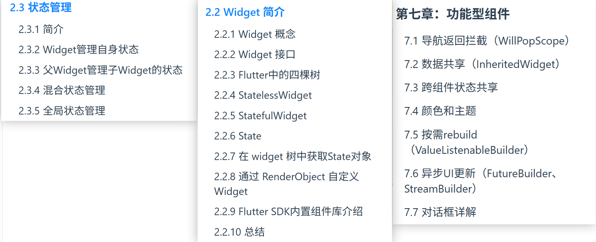
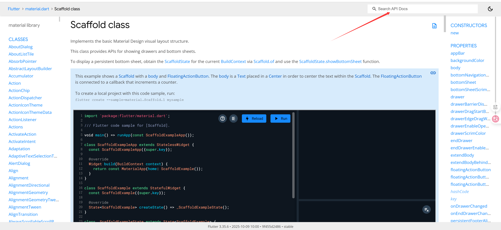
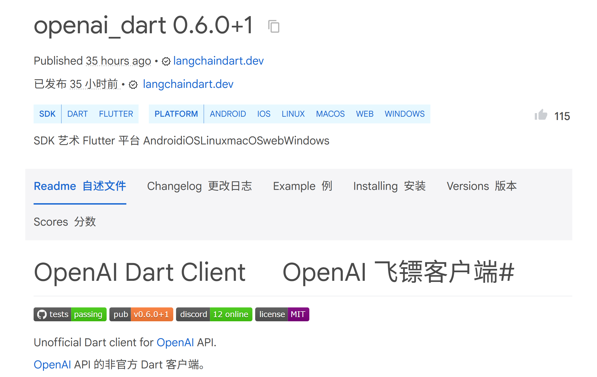
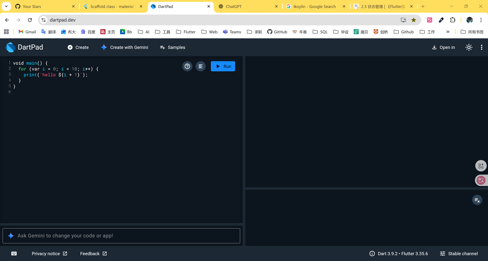

## 写在前面

需要知道的是:目前主流安卓开发还是Kotlin,这种是效率最高的原生开发,但缺点也很明显就是对应的ios版本需要重新用swift重构,造成一个app两个代码的情况,且社区支持有限,所以这也是Flutter诞生的背景,它可以多平台(Android,Ios,Win,Web),一套代码多次部署,社区活力不错,且Dart语法其实和Java无异,Flutter也具有一些TS的特征,上手完全不是问题,很适合你短期学习,大概3天左右? 就可以开始写一些初级应用,所以我也比较推荐新人上手做一些好玩的,它也很适合初创企业和独立开发者,当然后期高并发可能会遇到多线程和底层调用的情况但大概率都是企业级开发所以不用担心.

## **正文:**

说说我的习惯吧,我喜欢文档>博客>视频这种方式,因为入门更快,我们已经知道了java c面向对象的基本知识就不用花时间在语法,继承 多态  重写这边重复学习,前文我提到过,java和dart语法很像,所以语法方面简单看看不同异步机制(Java 是Future,Dart是async/await,Future),语法糖也和主流一样.所以简单看看基础或者直接边用边学思路是没问题的.

### 1.Flutter实战 第二版 

这是我我最常看的文档 ,时不时拿出来翻一下:

Flutter实战 第二版: https://book.flutterchina.club/#%E7%AC%AC%E4%BA%8C%E7%89%88%E5%8F%98%E5%8C%96

这是当前中文社区反馈最好的一版文档,由浅入深讲的非常好,而且想要完全读完十天半个月太轻松了,甚至于你只需要大概纵览然后挑你想看的部分即可,重点我觉得需要看的是:2.2widget简介,这是Flutter绘制的核心,然后是2.3状态管理 涉及到基础的后端callback,第七章:功能型Widget简介这是回调的具体应用,其他部分按需阅读即可.



### 2. Flutter官方引导网站:

https://docs.flutter.dev/

里面有着丰富的教学章节,跟着做一受益匪浅,而且有online演示,非常友好,缺点就是官方深层跳转比较多,想要看一些原理或者轻易理解没有Flutter实战 第二版来的清晰,

另外 https://flutter.cn/learn 是flutter中文社区,感觉一般,不如英文.

### 3.API文档

https://api.flutter.dev/flutter/material/Scaffold-class.html

重要性不言而喻,总之开发绕不开这个,有什么不会右上角直接搜就好.




### 4.官方工具包网站:

https://pub.dev/

跟npm一样,想要什么直接搜里面有详细的介绍,例如想要接入chat-gpt,直接搜gpt就有现成的独立开发者/官方开发者提前写好了包,跟随REAME文档直接做就好.



如图所示,社区支持非常好,已经更新到GPT5了,且最新一次在35小时前.


### 5.视频教程

本来是Udemy付费课程,但B站有搬运,老师在伦敦,发音很舒服,而且是Udemy最火的Python课程作者,本身是医学出身,所以对初学者教导友好.

跟着能做5-6个小型APP,掌握绝大多数逻辑和知识,除了有点耗时其实挺不错的,我跟着做了4个受益匪浅,当然读文档是最快的.

https://www.bilibili.com/video/BV1ku411v71e/

### 6.DartPad * (低优先级)

在线练语法的地方,作用有限,初学的时候可以在线使用看看语法的不同: https://dartpad.dev/



好消息是介入了Gemini,所以学习Dart或者面向对象的时候可以直接问,省去CHAT.


### 7.Material3设计 * (低优先级)

谷歌官方的设计美学,material也是flutter中一个重要的设计基底,里面有谷歌的设计传统,可以参考,没事看一看可以提升美学理解:

https://m3.material.io/styles


### 8.谷歌设计 * (低优先级)

https://fonts.google.com/里有字体的一些指导,你可以下载各个语言的不同字体和规范.


### 9.颜色搭配

对于只会红配绿的开发者而言,伟大,无需多言

https://www.materialpalette.com/


### 10.语法糖

有需要简单过一下,不用浪费多少时间

https://blog.csdn.net/crasowas/article/details/131970043

```DART
=>（箭头函数）与 TS无异
    
bool test() => true;
// 大致等价源码
bool test1() {
  return true;
}

```


### 11.面向对象四大支柱

这篇文章简短写的很好,不知道你的基础如何,不熟悉可以看看,但以你的能力有轻看之嫌.

https://www.freecodecamp.org/chinese/news/four-pillars-of-object-oriented-programming/#:~:text=%E9%9D%A2%E5%90%91%E5%AF%B9%E8%B1%A1%E7%BC%96%E7%A8%8B%E4%B8%AD%E7%9A%84,%E6%97%B6%E9%97%B4%E6%89%8D%E8%83%BD%E8%AF%BB%E5%AE%8C%E5%AE%83%E3%80%82


### 12.客户端查看BUG

这篇就解决了,有时候想要view效果和边距,Flutter Outline 会报Shows "Nothing to show"

https://stackoverflow.com/questions/60268180/flutter-outline-shows-nothing-to-show-in-android-studio